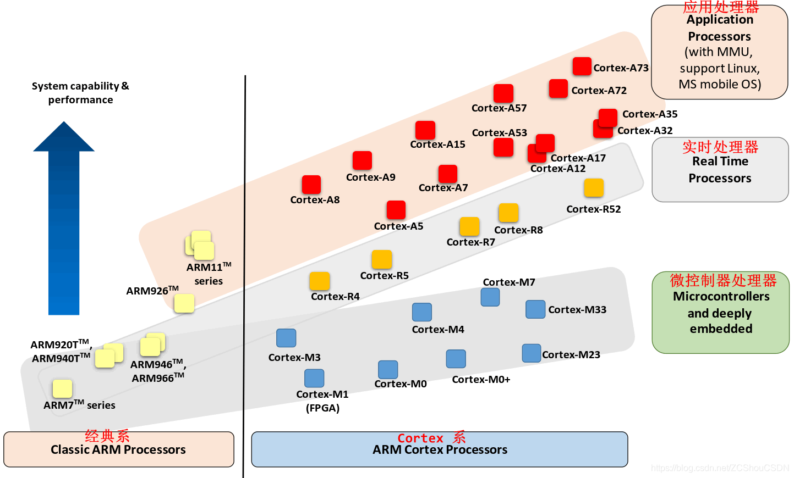
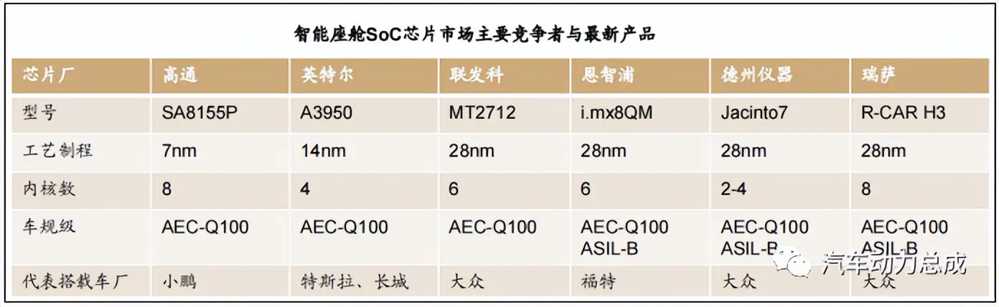
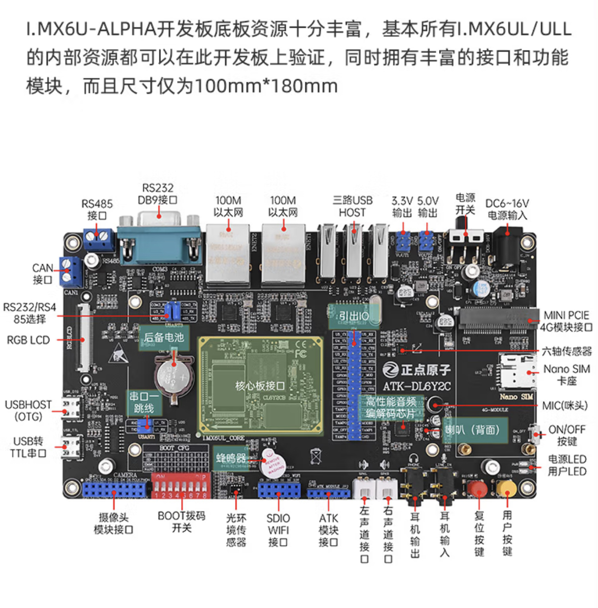
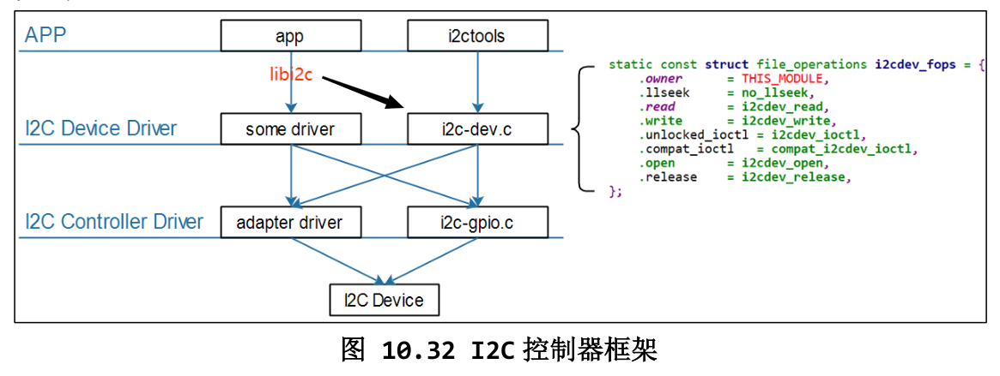
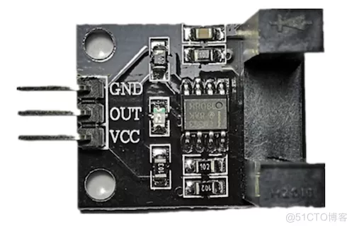

# 关于嵌入式编程
- [关于嵌入式编程](#关于嵌入式编程)
  - [1.嵌入式的基本概念](#1嵌入式的基本概念)
  - [2.ARM芯片组介绍](#2arm芯片组介绍)
    - [2.1 ARM处理器命名规范](#21-arm处理器命名规范)
    - [2.2 芯片选型](#22-芯片选型)
      - [I.MX芯片](#imx芯片)
      - [具体选型要考虑的问题](#具体选型要考虑的问题)
      - [2.2.1 非常棒的解决方案网站---乐鑫](#221-非常棒的解决方案网站---乐鑫)
      - [2.2.2 开发板的选择](#222-开发板的选择)
    - [2.3 开发板上的I/O接口初识](#23-开发板上的io接口初识)
      - [2.3.1串行通信和并行通信](#231串行通信和并行通信)
      - [2.3.2 CAN接口](#232-can接口)
      - [2.3.3 I²C 协议](#233-ic-协议)
        - [2.3.4 I2C Tools - Linux i2c Wiki](#234-i2c-tools---linux-i2c-wiki)
  - [3. 基础知识与工具](#3-基础知识与工具)
    - [3.1 示波器的作用和教程](#31-示波器的作用和教程)
    - [3.2 关于驱动](#32-关于驱动)
    - [3.3 交叉编译](#33-交叉编译)
      - [具体GCC的编译过程](#具体gcc的编译过程)
    - [3.4 Modbus通信协议](#34-modbus通信协议)
    - [3.5 linux的新工具](#35-linux的新工具)
      - [3.5.1 linux网络工具](#351-linux网络工具)
      - [3.5.2 Schemdraw--画简单的电路图](#352-schemdraw--画简单的电路图)
      - [3.5.3 mobaxterm(windows端)](#353-mobaxtermwindows端)
    - [3.6 不错的入门视频--从硬件电路到选型到软件](#36-不错的入门视频--从硬件电路到选型到软件)
      - [3.6.1 技术方案](#361-技术方案)
      - [3.6.2 最小系统](#362-最小系统)
      - [3.6.3 硬件选型](#363-硬件选型)
      - [3.6.4 硬件电路图的绘制](#364-硬件电路图的绘制)
      - [3.6.5 软件框架选择](#365-软件框架选择)
      - [3.6.6 软件编程](#366-软件编程)
  - [4. Linux基础与应用开发实战指南](#4-linux基础与应用开发实战指南)
    - [4.1 linux系统调用 \& I/O接口（软件层面）](#41-linux系统调用--io接口软件层面)
      - [4.1.1 linux系统调用](#411-linux系统调用)
      - [4.1.2 I/O接口“文件”](#412-io接口文件)
    - [4.2 传感器的驱动开发](#42-传感器的驱动开发)
      - [4.2.1 ADC（模拟信号转数字信号）](#421-adc模拟信号转数字信号)
      - [4.2.2 树莓派上使用光照强度检测（BH1750）传感器](#422-树莓派上使用光照强度检测bh1750传感器)
      - [4.2.3 ARM板上写的第一个驱动程序 - 知乎](#423-arm板上写的第一个驱动程序---知乎)
      - [4.2.4 温度传感器ds18b20的驱动编写过程](#424-温度传感器ds18b20的驱动编写过程)
      - [4.2.5 单输出引脚的传感器](#425-单输出引脚的传感器)
      - [4.2.6 树莓派GPIO控制光电传感器（水滴计数）](#426-树莓派gpio控制光电传感器水滴计数)
      - [4.2.7 linux GPIO编程](#427-linux-gpio编程)
        - [sysfs](#sysfs)
        - [libgpiod](#libgpiod)
        - [Linux下如何使用X86 CPU的GPIO](#linux下如何使用x86-cpu的gpio)
      - [4.2.8 蓝牙BLE通信开发](#428-蓝牙ble通信开发)
        - [低功耗蓝牙（Bluetooth Low Energy）协议栈](#低功耗蓝牙bluetooth-low-energy协议栈)
        - [BLE库安装](#ble库安装)
        - [BLE通信实战](#ble通信实战)
    - [4.3 PID控制](#43-pid控制)
      - [4.3.1 PID控制的概念](#431-pid控制的概念)
      - [4.3.2 PID算法](#432-pid算法)
    - [linux系统的一些问题汇总](#linux系统的一些问题汇总)
      - [树莓派开启串口（i2c）](#树莓派开启串口i2c)
      - [树莓派开启单总线(DS18B20获取实时温度)](#树莓派开启单总线ds18b20获取实时温度)
      - [linux为什么要挂载，直接访问/dev目录不行吗？](#linux为什么要挂载直接访问dev目录不行吗)
      - [Ubuntu x86 i2c控制器？](#ubuntu-x86-i2c控制器)
      - [linux markdown](#linux-markdown)
      - [linux 小飞机](#linux-小飞机)
      - [Ubuntu离线安装“软件”](#ubuntu离线安装软件)
      - [开机键的实现](#开机键的实现)
      - [linux 安装无线网卡](#linux-安装无线网卡)
      - [linux 安装时报错：can not acquire the dpkg frontend lock](#linux-安装时报错can-not-acquire-the-dpkg-frontend-lock)
      - [Ubuntu设置中文输入法](#ubuntu设置中文输入法)


## 1.嵌入式的基本概念

Q: 单片机、51单片机、ARM架构、STM32、ARM嵌入式开发都有啥区别和联系？

1. 单片机就区别于SOC，也就是几乎不可以（硬件不足以支持操作系统的很多功能，性能也很差，比如没有MMU）运行操作系统，用C语言/汇编直接操作裸机的一种芯片，一般8位的，至多32位（可以理解为CPU寄存器大小），在这个角度讲，STM32也属于一种单片机
2. 51单片机就是一种特殊型号的（8位）单片机，因为性价比高，长时间流行。主要用来执行单一简单的程序，甚至在现在（2020+）年代都称不上程序。
3. ARM架构区别于windows电脑常用的x86架构，主要是指令集的区别，硬件设计的思路不同，导致ARM架构的芯片在绝大多数低负载情形功耗远低于x86架构， 所以在手机、电器、路由器等计算需求不大（相比于电脑、服务器）的设备上应用。当然这也在悄然改变， 比如Mac电脑就用了ARM处理器，功耗低的同时性能甚至强于同定位的x86处理器。在架构上讲，STM32这款SOC的CPU就是用的ARM架构的。
4. ARM嵌入式开发是个不准确的概念，一般是指ARM架构的处理器，且能运行一般只用来运行Linux服务器的一种SOC，比如路由器上用的、有些智能家居设备用的等。所以STM32不属于ARM嵌入式开发，因为它不装linux系统，有点像传统单片机到ARM(linux)嵌入式开发的过度产品，但是很成功，很多人用，一定程度上也是因为这家公司开发了一套匹配的编程工具。


> ### 一篇把基本概念讲的很清楚的博客：
>
> [入坑嵌入式多年！Linux并没那么难，单片机也不简单！-面包板社区 (eet-china.com)](https://www.eet-china.com/mp/a40586.html)
>
> 我时常在想，现代社会发展变化速度之快超越了很多人的认知。罗胖子说**跟不上时代要交认知税**，很有道理。半导体和IT行业又是旋涡中心，发展更加快，其实想想其他行业的创新(美团外卖、滴滴打车、微信社交、淘宝京东电商，以及最新的新零售自动售货机、自动驾驶汽车等)本质上都是半导体行业的创新驱动的，都要靠先有芯片，先有配套的软件资源和开发人才，才能有人在这些行业创新。
>
> 入坑嵌入式开发多年的我，面对芯片及其相关的软件开发技术的快速发展变化，经常会去思考，这些发展变化的内在推动力和外在合理性在哪里，这些发展变化对我们有哪些启发和引导，身处旋涡中心应该何去何从，才能保证自己不被历史洪流冲走，才能不断提升自己的价值。
>
> **单片机**
>
> **单片机** 是中文名，对应的英文名称是“Single Chip Microomputer”，很多人可能奇怪平时不是都说MCU(Micro Control Unit)吗?
>
> 其实MCU准确翻译过来应该叫微控制器，现在很多中文书籍都用这个词，不用单片机了。因为单片机这个词是很多年前的概念了，在那个年代半导体工艺还在起步阶段，集成能力很差，往往是CPU一个芯片，SRAM一个芯片，Flash一个芯片，需要中断的话又得有个专门处理中断的芯片，所以一个完整可用的计算机系统是很多个芯片(Chip)做在一个PCB板上构成的。
>
> 单片机呢?就是在一个芯片(Chip)上集成了CPU、SRAM、Flash及其他需要模块，在一个Chip上实现一个微型计算机系统，所以就叫Single Chip Microcomputer，也就是单片机了。
>
> **其实从这个角度来讲，单片机这个词现在已经没意义了** ，因为现在的半导体工艺早就很厉害了，现在你买到的所有都是“单片机”，根本不存在分离式的所谓“多片机”。而且现代的单片机不但集成了CPU、SRAM、Flash等微型计算机不可少的部件，而且大多集成了很多内部外设，如Nand控制器、LCD控制器、串口通信、定时器、RTC等等， **所以现在的单片机其实应该叫SoC(System on Chip)。**
>
> 英文是很准确的。这里有好几个词你可以体会下各自含义：microcomputer、computer、system、microcontroller。不严格区分的话这些词很多时候可以互相替换和通用的，但是严格说其实各自有不同代指的。譬如computer，指的就是电脑，你可以理解为就是电脑，譬如笔记本、台式机这些。当然很多年前的电脑很庞大很笨重，所以computer就是指的这种有机箱外壳，有键盘鼠标，很庞大笨重，通用性强的电脑。而microcomputer指的就是单片机这类东西，它也是一个独立的电脑系统，有CPU和内存和外设这些，能跑计算机程序。但是他相对于computer来说体积很小，而且不是通用的而是专用的，所以叫microcomputer。
>
> system呢?更倾向于整个系统，也就是说 **system=microcomputer+各种外设** 。简单理解就是，当串口、LCD控制器等模块进入了Chip内部时，整个microcomputer就成为system了。所以其实system才是更有意义，更适合现代单片机芯片的一个名字。所以现在我们都把芯片叫SoC，这个名字更有价值。
>
> 那microcontroller呢? **现在很多单片机厂商都把自己的单片机叫microcontroller(微控制器)** ，其实我个人理解，觉得microcontroller的重点在于controller，也就是说他们想强调这个chip中集成的system是一个controller，擅长控制。而不是一个DSP(擅长运算)。
>
> **嵌入式**
>
> 嵌入式的全称是嵌入式系统，英文是Embeded system，所以可以看出嵌入式是一个system。
>
> 为什么叫嵌入式呢?这里的嵌入指的是我们把这个system(硬件上表现为一个Chip)嵌入到某个设备中去。譬如冰箱的板卡上的芯片就是一个嵌入到冰箱中的system，负责控制用户按键、冰箱照明灯、制冷系统等。可以看出，嵌入式系统这个名字主要是从芯片在使用时的组织形态来命名的。所以从这个角度讲，只要是被嵌入到设备中的芯片都可以被叫做嵌入式系统。
>
> 那这个范围太宽了，说真的你很难找到不属于嵌入式的system······所以我经常觉得嵌入式这个名词根本是废话，根本没意义。好在这个理解只是广义上的嵌入式的定义，但是我们平时讲嵌入式大多时候是从狭义上理解的。
>
> **狭义上讲** ，嵌入式是为了区别于单片机。我们经常把芯片中不带MMU(memory management unit)从而不支持虚拟地址，只能跑裸机或RTOS(典型如ucos、华为LiteOS、RT-Thread、freertos等)的system叫单片机(典型如STM32、NXP LPC系列、新的NXP imxRT1052系列等)，而把芯片自带MMU可以支持虚拟地址，能够跑Linux、Vxworks、WinCE、Android这样的操作系统的system叫嵌入式。所以linux WinCE等也常被叫做嵌入式操作系统，就是这么回事。你仔细回顾下，其实大部分人在讲单片机和嵌入式时都是从狭义角度出发的，并非广义。
>
> **单片机的技术和市场状况**
>
> 单片机是出货量最大的一类计算机。这个很好理解，因为单片机用途太广泛了，所有家电内置的控制系统几乎都是单片机的，这个数目就很惊人了。还有各种公共设施，工厂自动化设备等几乎也都是单片机控制的。单片机的厂商和品类也是非常多，我下面列举几类常用的。
>
> **8位和4位机**
>
> 这类单片机性能低配置低，但是优势是价格便宜。所以很多低端家电产品都会用到，小家电是这类单片机最大的市场。为了降低成本，这类单片机很多只能用汇编编程(当然近几年很多也提供了C编译器)，很多芯片采用bounding封装(就是芯片内核直接贴在PCB上然后用黑乎乎硬胶黏住，大家玩过LCD1602的看那后面那个圆盘型黑色的就是)。
>
> 做这类产品的以前都是台湾一些小芯片厂商。这些年中国大陆也涌现了很多这类芯片厂商，这些单片机行业大多对标某个具体应用领域，对行业需求很熟悉，直接推出适用这个行业的解决方案。外行的人可能根本都没听说过这种单片机的型号和相关信息。
>
> 总的来说，这属于比较低端的行业，不太建议大家学习和进入。尤其现在中国在搞产业升级，落后的传统家电产品不断降价还卖不出去，相反各种高端功能和外观的“产业升级”型家电产品利润很高。所以这种适用于传统老旧电子产品的芯片和技术其实并不值得去投入。
>
> **51单片机**
>
> 其实51单片机也是8位机，之所以单独拿出来说是因为51单片机实在太出名了。实际上当年单片机百家争鸣的时候(大约1980年代吧)51单片机只是其中一种，还有很多其他很厉害的，可惜都被时间给雨打风吹去了。
>
> 51单片机之所以出名并活到现在，是因为Intel后来开放了51内核的版权，所以很多公司很多人可以毫无顾忌的使用它而不担心付费或版权风险。实际上到了现在(2018年)，51单片机已经是很老很没有技术优势的解决方案了，但是为什么还在大量使用?主要有以下几个原因：
>
> 一是大量存量项目和存量开发者，这些人很熟悉51单片机，甚至很多老工程师可能只会51单片机，很多老的项目也不可能再去重新开发所以沿用了51单片机。
>
> 二是51单片机也够便宜，很多对性能没有过多要求的产品干脆就用51也挺好。
>
> 三是51内核开放，所以很多需要内置单片机核的SoC(譬如很多电容触摸屏芯片，很多指纹识别芯片等)就会选择用51核，不要钱还够用嘛，不选这个选谁。
>
> **很多同学问我还要不要学51单片机?我认为还是要学。**
>
> 一个原因是51单片机的开发用到的技术技能在开发别的单片机时照样有用，所以学了51将来再学其他的也会快很多，时间不会白花的。
>
> 另一个原因是确实有时候实际开发也会遇到用到51单片机的，所以学会了也算是个拿得出手的技能。所以如果你要学习单片机开发，从51单片机入手绝对不会错。但是要记得不要沉迷于51了，要迅速学会51单片机后，迅速继续学习更现代更实用的其他单片机(譬如stm32)。很多人学会51后就不动了，这就好像幼儿园毕业就不继续读书了一样，是不对的。
>
> **STM32单片机**
>
> 终于到了STM32这个当红辣子鸡了，ST于2007年发布了第一款STM32，至今已经11年了。STM32是ARM Cortex-M内核的单片机，实际上同样使用ARM Cortex-M系列内核的单片机还有很多(譬如NXP的LPC系列，原Freescale的K60系列，台湾新唐的M051系列，国内如兆易创新的GD32系列等)，STM32只是其中的代表作而已。
>
> ARM这些年风头很强，在application级别的SoC中大胜Intel，现在手机行业的芯片都被ARM吃掉了，MIPS之类的更是被压的生不如死。在单片机领域，ARM的Cortex-M系列(M0、M3、M4、M7)也是大获全胜，很多半导体厂商都放弃了自己原来的架构转而做ARM内核的单片机了。
>
> 怎么说呢，个人觉得ARM内核的单片机很适合当前时代，尤其STM32这种，不管硬件配置还是开发工具都深得市场认可，普及度越来越高。强烈建议大学学单片机就学STM32，会玩STM32很有价值。
>
> 至于GD32之类国产的类似STM32的单片机，我认为后面会越来越强，甚至会主导市场把洋品牌赶出中国。这些芯片的开发方式也很类同于STM32，所以会了STM32开发很容易切过去，不用担心。
>
> **其他单片机**
>
> 我指的是PIC、ATmega、MSP430、STM8之类的，这些不是很熟悉所以不予详细论述。总的来说，这些单片机性价比都不错，在各自领域都有一定竞争力，但是还是不如STM32使用领域宽广。所以除非是公司研发用到，否则不建议主动学习。
>
> **高性能高价格单片机**
>
> 这里我特指的是如STM32F7、STM32H7、NXP imxRT1052之类的单片机。这类虽然是单片机，但是性能比一般单片机强劲很多，外设也复杂很多，甚至需要外接SDRAM来提供更大内存，外接SLC Nand或Spiflash来提供存储。
>
> 同时从价格角度讲这些单片机大多在人民币30元以上，甚至高达100多元。这些真的是单片机中的战斗机，价格都能吓死人了。对于这类单片机，我个人其实很不看好。其实写这篇长文，就是想解释我为什么不看好这类单片机。感兴趣的同学可以继续看下文分析。
>
> **嵌入式的技术和市场状况**
>
> 嵌入式领域目前最火的就是 **ARM+linux和ARM+android。**
>
> 芯片都是基于ARM的，低端的有ARM9、ARM11，高端的有Cortex-A7、Cortex-A8、Cortex-A9、Cortex-A53、Cortex-A57等。从单核心到双核心、四核心、八核心都有。厂商也一大堆，国产进口台产等都有。覆盖面也广，消费级、工业级、车规级都有。
>
> 嵌入式级别的ARM因为有MMU所以可以很好的跑复杂OS，因此虽然芯片本身也可以裸机运行，但是基本没有人用这类芯片来跑裸机或者RTOS的。都会上操作系统。
>
> 简单说，如果产品不需要华丽美观的人机界面就上linux(譬如路由器、网络摄像机)，如果需要人机界面但是界面简单注重功能和稳定性，那就上linux+QT(譬如工控HMI、电动车充电桩、停车场显示)，如果产品很注重人机交互的用户体验，那就上Android(譬如智能手机、智能电视机、游戏机等)。
>
> 总的来说，嵌入式系统的复杂性高、开发难度大、学习曲线长。因为软件上的复杂性，导致出bug的可能性大。一旦出bug查找起来也更加需要技巧和经验。所以很多公司用嵌入式linux或android做产品问题很多，这一方面和开发者的技术能力有关，另一方面和公司不能花时间和成本去潜心把产品做稳定做成熟有关。
>
> **嵌入式和单片机的真正区别**
>
> 其实分析到这里，大家也知道了嵌入式和单片机的真正区别，那就是有没有linux或android这类复杂操作系统。
>
> 单片机不是裸奔就是RTOS，其实玩过RTOS和linux的同学都知道，RTOS虽然也叫操作系统，但是和linux这种根本不是一个级别。差远了，更不用说android了，android里随便拿出来一个模块代码量都比一个完整的RTOS都庞大，都要复杂。所以有没有linux/android这类复杂OS对开发来说真的很不一样。
>
> 譬如从C语言角度来讲，我的《嵌入式linux核心课程》第4部分《4.C语言深度解析》这个课程，就是专门针对嵌入式linux开发中C语言功力不足的人推出的。很多做了多年单片机的同学看了后都感慨，真的是不做linux不知道C语言水深。结构体和指针这些元素在单片机编程中完全体现不出来魅力，但是在linux内核中却得到了完美的发挥和释放。不去真正研究，实在很难体会出那种美感和震撼。
>
> **嵌入式和单片机的交集**
>
> 嵌入式和单片机有没有交集呢?这里说的交集意思是： 某些产品既可以用嵌入式来解决，也可以用单片机来解决。
>
> 以前是没有的。 你想想一般单片机几块钱十几块钱，而嵌入式系统SoC加上DDR和Flash至少几十块，怎么可能有交集。 就算单片机能做的事你嵌入式也能做，但是我十几块钱能搞定的工作凭什么要花几十块上嵌入式呢?所以以前这2者没交集。 根本不是一个档次范围内的事儿。
>
> 但是近两年情况发生了变化。 首先是很多高端单片机的配置和价格越来越高。 譬如2017年10月发布的NXP imxRT1052系列单片机，号称跨界处理器。 为什么叫跨界?跨的是哪两界?
>
> 我们知道单片机嘛，就要单芯片提供整个system，简单说至少cpu、sram、flash这三大件不能少，要不然根本无法独立运行嘛。 所以你看不管是51单片机还是STM32都是内部有CPU，有SRAM，有Flash的，这就是典型的单片机。
>
> 而嵌入式SoC不同，譬如S5PV210内部只有CPU和少量SRAM，它要正常工作需要外部集成DDR SDRAM和Flash(EMMC)。所以嵌入式的system不能在一个chip上，一般典型的嵌入式系统的system由一块核心板构成，这块核心板上集成了SoC、DDR SDRAM、Flash、电源模块等， **这叫嵌入式系统** 。而所谓跨界处理器，跨的就是单片机和嵌入式这两界。这个imxRT1052内部集成了CPU和SRAM，但是没有Flash，它需要外部提供独立的Flash芯片才能组成一个system。
>
> 所以这东西既不是典型的单片机也不是典型的嵌入式，但是既像单片机，又像嵌入式，所以NXP说这个是跨界处理器。甭管好不好用，名字听起来酷酷的。
>
> 顺便多说一句，NXP为什么这么设计?其实是因为单片机内置Flash都很贵，imxRT1052为什么能比同样性能的STM32便宜那么多，主要原因就是因为他没有内置Flash。
>
> 所以很多人都说ST落后于NXP了，其实没有。只能说NXP这个设计在单片机界是一种创新，对比来看显得STM32F7、STM32H7性价比太差了。不过实话实说，STM32的F7和H7确实性价比很垃圾，我都不知道就一个单片机卖一百多是准备上天?谁给ST的勇气这么定价的，梁静茹吗?
>
> 算了，懒得吐槽F7和H7了。就说这个跨界处理器imxRT1052吧，这东西主频有600MHz，有消费级和工业级，带各种外设(反正你能用到的基本都有了)，可以带最大分辨率1024*768的TFT LCD(当然了需要外接SDRAM作为显存)。这东西相对于普通单片机来说就是神一般的存在啊，一般玩单片机的看到这个数据吓得直接就跪下叫爸爸了。
>
> 再说价格，这东西官方公布的批量价格是人民币30元左右。想一想感觉性价比爆棚啊。其实STM32也没那么弱，F7和H7的主频虽然没有600MHz那么变态，但是H7的性能整体比RT1052并没有太大劣势。就算不叫爸爸一声大哥总逃不了。
>
> 之所以F7和H7没掀起大浪关键还是价格太吓人了，一般人听说100多直接心里骂娘转身走人了，根本不想了解你的性能。而imxRT1052的30元确实很诱人，听起来似乎真的是高性能低价格了，很多人甚至据此判断NXP要“干死”ST了。
>
> **跨界处理器的尴尬**
>
> 高性能跨界处理器初看似乎很不错，实际上并没有那么容易成功。原因就在于这种高性能单片机实际上和低性能高性价比的嵌入式linux解决方案比并没有优势。
>
> 是的，很多人觉得600M主频的单片机才30块很便宜很厉害。那是因为你不熟悉嵌入式的解决方案。实际上imxRT1052单芯片是不能很好工作的，他要实现高性能至少需要外置Flash和SDRAM，就算只是1Gbit的SLC Nand和32MB 的SDRAM，再加上RT1052BOM成本也在50元左右了。再加上RT1052虽然号称批量30元，但是实际上小批量拿货价都在40-50元，所以目前市场上RT1052的核心板售价都在120-150元之间了。这个价格其实并不便宜，有很多嵌入式linux的解决方案都比这个性价比高。
>
> 譬如NXP的imx6ul，内置Cortex-A7单核心，最高主频1.2GHz，也是工业级，各种你能想到的外设都有了。标配256MB SLC Nand和256MB DDR的核心板，市场最低售价119元，比RT1052还低一些。
>
> 实际上还有性价比更高的方案，譬如我们深创客推出的NUC972牛顿板中使用的新唐NUC972方案，内置64MB DDR，外部配置1Gbit SLC Nand。主板批量可以做到100元内。性价比完胜RT1052这类高性能单片机。
>
> 很多人可能会说，我不会嵌入式linux开发，我只会单片机开发啊。所以你linux的方案性价比再高跟我没关系，单片机的才跟我有关系。我想说这绝对是一种误解，百分百的误解。为什么?
>
> 单片机就三个字，你别觉得叫单片机的都是一种东西。 **单片机和单片机是不一样的，** 你觉得主频600MHz的单片机带1024*768分辨率的TFT LCD，它的开发方式和难度会和10块钱不到的STM32F103一样?软件开发是跟着硬件走的，什么样性能的硬件就应该配套什么样的软件开发方式和相应资源，也会要求开发者具备某种相应素质。
>
> 所以不要觉得都是单片机就亲切，就能玩。实际上要把高端单片机完全发挥性能做出好看的GUI并且用到项目中解决掉所有的BUG并不是一件容易的事情。
>
> **最后**
>
> 今天谈的东西都比较浅，主要是讲了下单片机和嵌入式系统的由来和差异。引出了高端单片机(STM32H7、imxRT1052等)和高性价比嵌入式linux解决方案的的一个对比。
>
> 主要是希望抛给大家一个思考点，引导大家去思考如何分析和评价一款芯片方案，从而在做项目时能够更好的选型适合自己的芯片方案。
>
> **总的来说，我的观点是** ：能用几块十几块的单片机就用单片机，如果这些高性价比的单片机不能满足要求非要上几十块的高性能单片机，那你确实应该考虑下是否应该一步到位上高性价比的嵌入式linux解决方案。很多人担心linux不会开发，其实不应该这么考虑。
>
> **真正沉下去做项目，你会发现用嵌入式linux并没有那么难，而且高端单片机加上RTOS和一堆框架、协议栈之后也不简单。** 出了问题也不好找。而且嵌入式linux经过多年积累，其方案稳定性大多都不错。而高端单片机的配套RTOS和框架协议栈等中间件往往处在发展初期，往往bug很多。因此，建议大家值得投入时间去学习嵌入式linux软件开发的技能。


## 2.ARM芯片组介绍



### 2.1 ARM处理器命名规范

> 
> - ARM7：ARMv4架构
> - ARM9：ARMv5架构
> - ARM11：ARMv6架构
> - ARM-Cortex 系列：ARMv7架构
>
> ARM7没有MMU(内存管理单元)，只能叫做MCU（微控制器），不能运行诸如Linux、WinCE等这些现代的多用户多进程操作系统， 因为运行这些系统需要MMU，才能给每个用户进程分配进程自己独立的地址空间 。ucOS、ucLinux这些精简实时的RTOS不需要MMU，当然可以在ARM7上运行。
>
> ARM9、ARM11，是嵌入式CPU（处理器），带有MMU，可以运行诸如Linux等多用户多进程的操作系统，应用场合也不同于ARM7。
>
> **到了ARMv7架构（也就是ARM11系列）的时候开始以Cortex来命名，并分成Cortex-A、Cortex-R、Cortex-M三个系列**。 三大系列分工明确：“A”系列面向尖端的基于虚拟内存的操作系统和用户应用； “R”系列针对实时系统； “M”系列对微控制器。 **简单的说Cortex-A系列是用于移动领域的CPU，Cortex-R和Cortex-M系列是用于实时控制领域的MCU。**
> 
> 要注意的是，即使最新几代的ARM cortex-M系列，因为没有MMU等适配(非实时)操作系统的硬件， 也不能运行linux，反而较老架构的的ARM9、ARM11系列是可以的。
>
> #### Cortex[处理器系列](https://en.wikipedia.org/wiki/List_of_ARM_processors)
>
> `Application Processors` （应用处理器）–面向移动计算，智能手机，服务器等市场的的高端处理器。这类处理器运行在很高的时钟频率（超过 1GHz），支持像 Linux，Android，MS Windows 和移动操作系统等完整操作系统需要的内存管理单元（MMU）。如果规划开发的产品需要运行上述其中的一个操作系统，你需要选择 ARM应用处理器.
>
> `Real-time Processors` （实时处理器）–面向实时应用的高性能处理器系列，例如硬盘控制器，汽车传动系统和无线通讯的基带控制。多数实时处理器不支持 MMU，不过通常具有 MPU、Cache 和其他针对工业应用设计的存储器功能。实时处理器运行在比较高的时钟频率（例如 200MHz 到 >1GHz ），响应延迟非常低。虽然实时处理器不能运行完整版本的 Linux 和 Windows 操作系统，但是支持大量的实时操作系统（RTOS）。
>
> `MicrocontrollerProcessors` （微控制器处理器）–微控制器处理器通常设计成面积很小和能效比很高。通常这些处理器的流水线很短，最高时钟频率很低（虽然市场上有此类的处理器可以运行在 200Mhz 之上）。并且，新的 Cortex-M处理器家族设计的非常容易使用。因此，ARM 微控制器处理器在单片机和深度嵌入式系统市场非常成功和受欢迎。
>
> Cortex-M 处理器家族更多的集中在低性能端，但是这些处理器相比于许多微控制器使用的传统处理器性能仍然很强大。例如，Cortex-M4 和 Cortex-M7 处理器应用在许多高性能的微控制器产品中，最大的时钟频率可以达到400Mhz。当然，性能不是选择处理器的唯一指标。在许多应用中，低功耗和成本是关键的选择指标。因此，Cortex-M 处理器家族包含各种产品来满足不同的需求：
>


### 2.2 芯片选型

当然，如果不必要用linux系统做设备，可以用STM32系列的芯片，再后面选开发板时还会提及，ARM架构有几种工业常用的型号，其中IMX系列常被用于学习的开发板。具体见下图：



> 引文节选自：https://www.zhihu.com/question/439390200/answer/1793090155
>
> #### 1．芯片、软件成熟度：
>
> - IMX6ULL是[NXP公司](https://www.zhihu.com/search?q=NXP公司&search_source=Entity&hybrid_search_source=Entity&hybrid_search_extra={"sourceType"%3A"answer"%2C"sourceId"%3A1793090155})的、经过考验的芯片，
> - 在众多工控领域、汽车电子上都应用广泛，
> - Linux内核等配套软件都比较成熟稳定了。
> - 而STM32MP157是ST公司的第一款能运行Linux的芯片，
> - 在产品应用、软件成熟度方面都弱于IMX6ULL。
>
> #### 2. 性能与价格
>
> - STM32MP157性能强于IMX6ULL，价格也贵于IMX6ULL。
> - 所以做产品的话需要考虑性价比。
>
> #### 3. 就学习而言：
>
> - STM32MP157有3个核：2个A7用来运行Linux，1个M4用来运行[单片机程序](https://www.zhihu.com/search?q=单片机程序&search_source=Entity&hybrid_search_source=Entity&hybrid_search_extra={"sourceType"%3A"answer"%2C"sourceId"%3A1793090155})。
> - STM32MP157还有GPU。
> - 理论上使用STM32MP157可以学习到更多知识；但是目前IMX6ULL的资料是更多。
> - 但是无论你是买IMX6ULL还是买STM32M157，我们的视频都是先讲同性再讲特性，你都可以学习。

#### [I.MX芯片](https://en.wikipedia.org/wiki/I.MX)

它是NXP(恩智浦)公司基于ARM架构设计的工业级应用的芯片。有广泛的应用市场，长期（10-15年）供货支持，可以作为开发医疗设备芯片。

#### 具体选型要考虑的问题

> 下文转自：[ARM处理器芯片选型指南-东凌工控 (east-atom.com)](http://www.east-atom.com/84213009.html)
>
> 要选好一款处理器，要考虑的因素很多，不单单是纯粹的硬件接口，还需要考虑相关的操作系统、配套的开发工具、仿真器，以及工程师微处理器的经验和软件支持情况等。微处理器选型是否得当，将决定项目成败。当然，并不是说选好微处理器，就意味着成功，因为项目的成败取决于许多因素;但可以肯定的一点是，微处理器选型不当，将会给项目带来无限的烦恼，甚至导致项目的流产。
>
> 　　**1 嵌入式微处理器选型的考虑因素**
>
> 　　在产品开发中，作为核心芯片的微处理器，其自身的功能、性能、可靠性被寄予厚望，因为它的资源越丰富、自带功能越强大，产品开发周期就越短，项目成功率就越高。但是，任何一款微处理器都不可能尽善尽美，满足每个用户的需要，所以这就涉及选型的问题。
>
> 　　(1)应用领域
>
> 　　一个产品的功能、性能一旦定制下来，其所在的应用领域也随之确定。应用领域的确定将缩小选型的范围，例如：工业控制领域产品的工作条件通常比较苛刻，因此对芯片的工作温度通常是宽温的，这样就得选择工业级的芯片，民用级的就被排除在外。目前，比较常见的应用领域分类有航天航空、通信、计算机、工业控制、医疗系统、消费电子、汽车电子等。
>
> 　　(2)自带资源
>
> 　　经常会看到或听到这样的问题：主频是多少?有无内置的以太网MAC?有多少个I/O口?自带哪些接口?支持在线仿真吗?是否支持OS，能支持哪些OS?是否有外部存储接口?……以上都涉及芯片资源的问题，微处理器自带什么样的资源是选型的一个重要考虑因素。芯片自带资源越接近产品的需求，产品开发相对就越简单。
>
> 　　(3)可扩展资源
>
> 　　硬件平台要支持OS、RAM和ROM，对资源的要求就比较高。芯片一般都有内置RAM和ROM，但其容量一般都很小，内置512 KB就算很大了，但是运行OS一般都是兆级以上。这就要求芯片可扩展存储器。
>
> 　　(4)功 耗
>
> 　　单看“功耗”是一个较为抽象的名词。这里举几个形象的例子：
>
> 　　①夏天使用空调时，家里的电费会猛增。这是因为空调是高功耗的家用电器，这时人们会想，“要是空调能像日光灯那样省电就好了”。
>
> 　　②随身的MP3、MP4都使用电池。正当听音乐看视频时，系统因为没电自动关机，谁都会抱怨“又没电了!”
>
> 　　③目前手机一般使用锂电池，手机的待机和通话时间成了人们选择手机的重要指标。待机及通话时间越长，电池的使用寿命就可以提高，手机的寿命也相对提高了。
>
> 　　以上体现了人们对低功耗的渴求。低功耗的产品即节能又节财，甚至可以减少环境污染，它有如此多的优点，因此低功耗也成了芯片选型时的一个重要指标。
>
> 　　(5)封 装
>
> 　　常见的微处理器芯片封装主要有QFP、BGA两大类型。BGA类型的封装焊接比较麻烦，一般的小公司都不会焊，但BGA封装的芯片体积会小很多。如果产品对芯片体积要求不严格，选型时最好选择QFP封装。
>
> 　　(6)芯片的可延续性及技术的可继承性
>
> 　　目前，产品更新换代的速度很快，所以在选型时要考虑芯片的可升级性。如果是同一厂家同一内核系列的芯片，其技术可继承性就较好。应该考虑知名半导体公司，然后查询其相关产品，再作出判断。
>
> 　　(7)价格及供货保证
>
> 　　芯片的价格和供货也是必须考虑的因素。许多芯片目前处于试用阶段(Sampling)，其价格和供货就会处于不稳定状态，所以选型时尽量选择有量产的芯片。
>
> 　　(8)仿真器
>
> 　　仿真器是硬件和底层软件调试时要用到的工具，开发初期如果没有它基本上会寸步难行。选择配套适合的仿真器，将会给开发带来许多便利。对于已经有仿真器的人们，在选型过程中要考虑它是否支持所选的芯片。
>
> 　　(9)OS及开发工具
>
> 　　作为产品开发，在选型芯片时必须考虑其对软件的支持情况，如支持什么样的OS等。对于已有OS的人们，在选型过程中要考虑所选的芯片是否支持该OS，也可以反过来说，即这种OS是否支持该芯片。
>
> 　　(10)技术支持
>
> 　　现在的趋势是买服务，也就是买技术支持。一个好的公司的技术支持能力相对比较有保证，所以选芯片时最好选择知名的半导体公司。
>
> 　　另外，芯片的成熟度取决于用户的使用规模及使用情况。选择市面上使用较广的芯片，将会有比较多的共享资源，给开发带来许多便利.
>
> 　　**2 ARM公司及相关产品介绍**
>
> 　　ARM公司于1991年成立于英国剑桥，主要出售ARM IP的授权。目前，ARM处理器(即采用ARM IP核的处理器)已遍及工业控制、消费类电子产品、通信系统、网络系统、无线系统等各类产品市场。ARM处理器应用占据了32位RISC微处理器很大的市场，ARM技术已渗入生活的各个方面。
>
> 　　目前市面上常见的ARM处理器架构可分为ARM7、ARM9、ARM10、ARM11以及Cortex系列，每个系列又包括很多种IP内核的产品。ARM也是嵌入式处理器中首先推出多核架构的厂商。生产ARM芯片的厂家很多，主流半导体厂商的产品比较齐全，供货也相对更有保障。Samsung、NXP、 Cirrus Logic、Atmel、Freescale、TI、ST、Winbond等主流半导体厂商的ARM芯片产品种类丰富，应用范围很广。
>
> 　　**3 嵌入式微处理器选型示例**
>
> 　　(1)需求
>
> 　　①适合于工业控制的温度。
>
> 　　②支持VxWorks、Linux操作系统。
>
> 　　③存储方面，SDRAM大于16 MB，Flash大于8 MB。
>
> 　　④主频方面，60 MHz以上。
>
> 　　⑤接口方面具有带DMA控制的Ethernet MAC、2个以上RS232串口、1个USB 2.O接口、1个SPI接口，以及大于30个GPIO引脚(不包括数据总线、地址总线和CPU内置接口总线)。
>
> 　　⑥提供实时时钟或实时定时器。
>
> 　　⑦引脚封装为QFP。
>
> 　　⑧价格为<200元。
>
> 　　(2)选型需求分析
>
> 　　根据需求①，参照前述选购的考虑因素中的“应用领域”，把要选的芯片定位于工业控制领域。目前市场上生产较适合用于作工业控制的微处理器的半导体公司有 NXP、Atmel、ST公司(Samsung公司的产品较适合用于PDA、多媒体产品，Cirrus Logic公司的产品较适合音频产品。)根据需求②，参照选购的考虑因素中的“OS及开发工具”，VxWorks5.5对于ARM核支持到V5T架构，所以把选型范围缩小到ARM7和ARM9系列。由于需要支持Linux操作系统，所以最好选择带有MMU的内核，因为不带MMU内核(ARM7TMDI)支持的Linux操作系统非常有限，只能支持UCLinux。
>
> 　　根据需求③，结合各种型号的芯片资源介绍，不难看出要求芯片必须带有可扩展存储接口，因为芯片的内置存储量不可能那么大。所以只能选择带可扩展存储接口的芯片。NXP公司的LPC2400系列和LH7A具备此项功能，Atmel公司的AT91SAM7SE系列、AT91RM9200、AT91SAM9系列也满足此项需求。
>
> 　　根据需求④、⑤、⑥、⑦，参照选购的考虑因素中的“价格及供货保证”，结合NXP、Atmel公司的芯片资源介绍，把选型范围框定在LPC2468 (LPC2400系列中的其他产品要么处于样片阶段，要么处于开发阶段，而LH7A资源不满足要求)、AT91RM9200和AT91SAM9260 (AT91SAM7SE系列处理速度太慢，AT91SAM9261和AT91SAM9263封装不满足需求)型号上。根据需求⑧，上一步所选的3个型号都能满足要求。
>
> 　　(3)选型结论
>
> 　　综合需求和芯片各方面的资源，选型结论如下：
>
> 　　①从产品开发周期角度考虑，AT91RM9200最为适合，它在这4个芯片中开发周期应该最短;
>
> 　　②从技术可继承性角度考虑，且对开发周期没有严格限制的话，AT91SAM9260较为合适;
>
> 　　③如果单支持VxWorks，对Linux支持要求不高，且对开发周期没有严格限制的话，LPC2468较为合适;
>
> 　　④综合各方面考虑，STR912排在其他三者之后。
>
> 　　选型满意度从高到低的排列顺序是：AT91RM9200、AT91SAM9260、LPC2468、STR912。

#### 2.2.1 [非常棒的解决方案网站---乐鑫](https://www.espressif.com.cn/zh-hans/home)

#### 2.2.2 开发板的选择

类似芯片选型，虽然不用特别高性能的，但是老的（性能差的）不一定便宜，因为有些芯片停产了， 类似内存，现在买DDR3的并不比DDR4的便宜（2020年+）。另外太老的可能支持的系统、协议都过时了，用法变了。By the way，**STM32系列是一直跟着ARM cortexM更新的，是除ARM-linux的首选**。


### 2.3 开发板上的I/O接口初识

* [The Linux driver implementer’s API guide — The Linux Kernel documentation](https://www.kernel.org/doc/html/latest/driver-api/index.html)



####  2.3.1串行通信和并行通信

现在大部分传输协议都是串行，因为并行传输会有很多问题，比如**并行信号如何同步**等问题。

> [为什么串口比并口快？---知乎](https://www.zhihu.com/question/27815296)
>
> 在一个独立的信道上，每次同时传输1bit为串口，每次同时传输多个bit为并口。标准的串口如XAUI，HDMI等，每对差分线组成一个信道（channel）,每个信道是否能成功传输并不取决于其他信道。而DDR这种，10根线组成一个信道，每次同时传8bit，错了某一bit只能重新传，便是标准并口，芯片内部的[并转串](https://www.zhihu.com/search?q=并转串&search_source=Entity&hybrid_search_source=Entity&hybrid_search_extra={"sourceType"%3A"answer"%2C"sourceId"%3A38699109})和IO并不相关，不影响定性。按照这个定义，大家看看各种[接口协议](https://www.zhihu.com/search?q=接口协议&search_source=Entity&hybrid_search_source=Entity&hybrid_search_extra={"sourceType"%3A"answer"%2C"sourceId"%3A38699109})怎么划分呢？我觉得已经很清楚了，以单个channel的传输速率衡量，串口一般来说更快。下一个问题就是，为什么呢？

还有一个问题就是：USB3.0比2.0多了两对数据针脚，那它还能叫串口吗？虽然好几根数据线，但是多个数据线不同时发送数据，就还是串行。By the way，USB全称Universal Serial Bus，就是通用串行总线。


#### 2.3.2 [CAN接口](https://www.eet-china.com/mp/a31396.html)

> [CAN总线的简单介绍](https://www.bilibili.com/video/BV1Ae411W7oE)
>
> 是最初用于汽车内各个芯片的数据传输协议，类似Ethernet，但有所不同。


#### 2.3.3 [I²C 协议](https://en.wikipedia.org/wiki/I²C)


> [SPI、UART、I2C通信的区别与应用！-面包板社区 (eet-china.com)](https://www.eet-china.com/mp/a87076.html)
>
> 这个与CAN、Ethernet是啥关系？
>
> 
>
> 是平级关系。所有通信协议都是类似的，由于不同类型的通信对延迟、速率、简易性、稳定性要求各不同，才催生出了不同的通信协议和接口规范。
>
> 
>
> 当然，也不都是平级关系。比如Ip协议就是基于Ethernet协议的，也就是其数据报文被包含在Ethernet数据报内，具体网络协议说的非常清楚了。要注意的是,Ethernet跟他们类似，都是直接在物理层的，也就是协议对I/O接口的二进制数据做出规范，而Ip则不同，更像是软件层面，对Ethernet的“补强”，至于为何不直接更新Ethernet协议呢？是因为不需要Ip协议而依然需要Ethernet传输的场景还是很多的，更上层的TCP同理。
>
> 
>
> 所以严格来说，所有直接对物理接口的数据作出规范的协议，它们之间是平级关系，但是物理接口和设备控制器可以做成同时支持多个传输协议的，比如USB3.x同时支持DP、USB、HDMI等协议。
>
>  
>
> 为什么需要这么多协议呢？有的需要对报文结构不要做出太多要求，有更多的灵活性，接线简单，就像是UART、i2c协议；有的可能对多机设备通信有需求，像是CAN。CAN和Ethernet的一个重要区别就是用CAN通信的设备不需要地址，符合一个工业设备中多个芯片自动协同的场景。


anyway，这一般是ADC（模拟信号转数字信号）模块的信号输出时采用的传输协议，与其类似的有SPI、UART等


##### 2.3.4 [I2C Tools - Linux i2c Wiki](https://i2c.wiki.kernel.org/index.php/I2C_Tools)

* [**I2C and SMBus Subsystem — The Linux Kernel documentation**](https://www.kernel.org/doc/html/latest/driver-api/i2c.html)

上面链接是linux内核开发的官方文档，非常有指导意义。



> 下文节选自：[在用户空间实现I2C设备驱动程序-cnblogs](https://www.cnblogs.com/wanglouxiaozi/p/15158246.html)
>
> 
>
> 当你使用/dev接口I2C时内核内部发生的代码流:
>
> 1. 您的程序打开/dev/i2c-N并在其上调用ioctl()，如上面的“C示例”部分所述。
> 2. 这些 open() 和 ioctl() 调用是由 i2c-dev 内核驱动程序处理的:分别参见 i2c-dev.c:i2cdev_open() 和 i2c-dev.c:i2cdev_ioctl()。您可以将 i2c-dev 视为可以从用户空间编程的通用I2C芯片驱动程序。
> 3. 一些 ioctl() 调用用于管理任务，由 i2c-dev 直接处理。示例包括I2C_SLAVE(设置要访问的设备的地址)和I2C_PEC(在未来事务中启用或禁用SMBus错误检查)。
> 4. 其他 ioctl() 调用被i2c-dev转换为内核函数调用。示例包括I2C_FUNCS，它使用 i2c.h:i2c_get_functionality() 查询I2C适配器功能，以及I2C_SMBUS，它使用i2c-core-smbus.c:`i2c_smbus_xfer()`执行SMBus事务。i2c-dev 驱动程序负责检查来自用户空间的所有参数的有效性。在此之后，这些通过 i2c-dev 从用户空间发出的调用与由内核I2C芯片驱动程序直接执行的调用之间就没有区别了。这意味着I2C总线驱动程序不需要实现任何特殊的东西来支持来自用户空间的访问。
> 5. 这些 i2c.h 函数是对I2C总线驱动程序的实际实现的包装。每个适配器都必须声明实现这些标准调用的回调函数。I2c.h: i2c_get_functions() 调用 i2c_adapter.algo->functional()，而 i2c-core-smbus.c:i2c_smbus_xfer() 如果实现了，则调用 adapter.algo->smbus_xfer()，如果没有实现，则调用 i2c-core-smbus.c:i2c_smbus_xfer_emulated()，后者反过来调用 i2c_adapter.algo->master_xfer()。
>
> 在您的I2C总线驱动程序处理了这些请求之后，沿着调用链向上执行，几乎不做任何处理，除了通过 i2c-dev 将返回的数据打包成适合 ioctl 的格式。

**i2c tools应用**

```shell
➜ ls /dev/i2c-*
/dev/i2

➜ i2cdetect -l
i2c-0 ...
i2c-1 ...
```


## 3. 基础知识与工具

软件方面很多都是操作系统、编译等知识，老生常谈了。

硬件方面数字电路，接口协议等也要掌握。

工具方面也要更新了， 比如linux系统一些开发工具，很多网络教程都是20年前的，软件停止维护了10年了。


### 3.1 [示波器的作用和教程](https://www.bilibili.com/video/BV1K44y147LK)

> 比如查看电压抖动之类的。


### 3.2 关于驱动

* [老司机带你探索内核编译系统 - Kernel Exploring](https://richardweiyang-2.gitbook.io/kernel-exploring/00_index)

* https://www.bilibili.com/video/BV1w4411B7a4

* [阅读GPIO datasheet/数据手册 (就是I/O接口的设计手册)](https://www.bilibili.com/video/BV1ba411g78y)

* [Linux设备驱动程序--豆瓣](https://book.douban.com/subject/1723151/)

《Linux设备驱动程序》是一本很好的关于驱动开发的书籍，建议在学习Arm-Linux嵌入式时，配合食用。


### 3.3 交叉编译

> https://www.bilibili.com/video/BV1w4411B7a4

可执行的二进制文件, 比如windows的.exe, 一般被称为ELF文件, 硬件(主要是CPU)架构不同, 格式要求也不同, 因为对应的机器指令集不同.

所谓的交叉编译, 就是下载一个编译器, 能在一种架构机器下运行, 但是能把源码编译成另一个架构的ELF文件.

所以就是在自己电脑下载安装对应开发板的交叉编译工具, 设置好环境变量, 要编译需要在开发板上运行的程序(ELF文件), 用这个指令(交叉编译工具)编译好, 再拷贝到板子上, 这样比直接在板子编译要快, 因为板子CPU性能肯定比电脑差很多, 调试源码也不方便.


#### 具体GCC的编译过程

虽然都是老生常谈了,  但[他讲的](https://www.bilibili.com/video/BV1w4411B7a4)还是不错的, 用`gcc -o ***.c -v`来看看编译过程, 再比如: [gcc编译时生成依赖文件](https://www.bilibili.com/video/BV1w4411B7a4)在视频中6分钟位置.


### 3.4 Modbus通信协议


### 3.5 linux的新工具


#### 3.5.1 linux网络工具

很多教程都在使用老的系统工具, 比如网络工具包net-tools, 2001年就停止维护了, 现在系统默认的iproute2 & netplan查询和设置网络.

具体讲解见:[Ubuntu20.04网络配置](https://www.360blogs.top/ubuntu20-04-netplan/)

比如配置netplan的配置文件时, 服务器端用networkd就好, 没必要用NetworkManager, 具体可以查查区别

>  **[硬软件工具－－稚辉君](https://www.bilibili.com/video/BV1F7411u71s)**
>
>  工业级芯片电路图，有个开源的国产软件---立创EDA；同类型还有kicad也是开源的。
>
>  画简单的电路图可以用python+Schemdraw


#### 3.5.2 Schemdraw--画简单的电路图


> ### [怎么放置元件/Placing Elements](https://schemdraw.readthedocs.io/en/latest/usage/placement.html)
>
> with schemdraw.Drawing() as d:
>  d += elm.Capacitor()
>  d += elm.Resistor()
>  d += elm.Diode()
>
> #### 方向选择：
>
> 放置时增加方向的methods就可以改变防止方向，并且直到下次改变
>
>  d += elm.Capacitor()
>  d += elm.Resistor().up()
>  d += elm.Resistor()
>  d += elm.Diode().right()
>
>
> #### 各种连接方式
>
> 按方向（up,down,lef,right），按起点终点(at, to)， 按端口，按x，y(tox,toy)， 封闭（endpoints）
>
> 多连接， dot， push，pop
>
> 指定位置：drop， hold， here
>
> at方法指定器件起始端连接引脚
>
> 
>
> ```python
> d += (opamp := elm.Opamp())
> 
> d += elm.Resistor().left().at(opamp.in2).label("R1")
> d += elm.Resistor().at(opamp.in1).label("R2")
> d += elm.Resistor().right().at(opamp.out).label("R3")
> ```
> dot方法打连接点， length方法增加长度
>
> 
>
> ```python
> d += elm.Dot()
> d += elm.Resistor()
> d += elm.Dot()
> d += elm.Diode().length(6)
> d += elm.Dot()
> ```
> to方法指定末端连接位置
>
> 
>
> ```python
> R = d.add(elm.Resistor())
> C = d.add(elm.Capacitor().up())
> Q = d.add(elm.Diode().to(R.start))
> ```
> tox和toy方法用于划线到指定位置，其实是to x 和to y
>
> 
>
> ```python
>  d += (C := elm.Capacitor())
>  d += elm.Diode()
>  d += elm.Line().down()
>  d += elm.Line().tox(C.start) # line to the x value of start of C
>  d += elm.Resistor().up()
> ```
> endpoints方法更直接，在两个指定端点之间放置元件
>
> 
>
> ```python
>  d += (R := elm.Resistor())
>  d += (Q := elm.Diode().down(6))
>  d += elm.Line().tox(R.start)
>  d += elm.Capacitor().toy(R.start)
>  d += elm.SourceV().endpoints(Q.end, R.start)
> ```
> 控制翻转： flip 左右， reverse 上下
>
> 
>
> ```python
>  d += (opamp := elm.Opamp())
>  d += elm.Zener().left().label('Normal').at(opamp.in1)
>  d += elm.Zener().left().flip().label('Flip').at(opamp.in2)
> ```
> push和pop方法用于配置绘制方向，可在连接点用于多个方向连接时的绘制
>
> 
>
> ```python
>  d += elm.Inductor()
>  d += elm.Dot()
> 
>  d.push()  # Save this drawing position/direction for later
> 
>  d += elm.Capacitor().down()  # Go off in another direction temporarily
>  d += elm.Ground(lead=False)
> ```
>
> 
>
> ```python
>  d.pop()   # Return to the pushed position/direction
> 
>  d += elm.Diode()
> ```
> drop & hold 保持不移动 一个元件的位置坐标值为1
>
> 
>
> ```python
>  d += elm.Diode()  # Normal placement: drawing position moves to end of element
>  d += elm.Dot().color('red')
> 
>  d.here = (0, -1)
>  d += elm.Diode().hold()  # Hold method prevents position from changing
>  d += elm.Dot().color('blue')
> ```
>
>
> #### 配置参数，设置label
>
> 表达方式：label支持utf-8格式的字符串， 支持LaTeX数学公式表达方式
>
> 数学表达式的具体表达，可参考如下连接
>
> Writing mathematical expressions — Matplotlib 3.5.1 documentation
>
> with schemdraw.Drawing() as d:
>  d += elm.Resistor().label('1MΩ')
>  d += elm.Capacitor().label('1μF')
>  d += elm.Capacitor().label(r'$v = \frac{1}{C} \int i dt$')
>  d += elm.Resistor().at((0, -2)).label('$R_0$')
>  d += elm.Capacitor().label('$x^2$')
> 放置位置， loc：top, bottom,right, left

>
> ```python
> d += elm.Resistor().label('1MΩ')
> d += elm.Capacitor().label('1μF')
> d += elm.Capacitor().label(r'$v = \frac{1}{C} \int i dt$')
> d += elm.Resistor().at((0, -2)).label('$R_0$')
> d += elm.Capacitor().label('$x^2$')
> # label for location
> 
> d += (elm.Resistor().at((0,-4))
>     .label('Label')  # 'top' is default
>     .label('Bottom', loc='bottom')
>     .label('Right', loc='right')
>     .label('Left', loc='left'))
> ```
> 放置位置也可以跟随角点走
>
> 
>
> ```python
> # label for value
> d += elm.Resistor().label('1MΩ')
> d += elm.Capacitor().label('1μF')
> d += elm.Capacitor().label(r'$v = \frac{1}{C} \int i dt$')
> d += elm.Resistor().at((0, -2)).label('$R_0$')
> d += elm.Capacitor().label('$x^2$')
> # label for location
> 
> d += (elm.Resistor().at((0,-4))
>     .label('Label')  # 'top' is default
>     .label('Bottom', loc='bottom')
>     .label('Right', loc='right')
>     .label('Left', loc='left'))
>  
> d += (elm.BjtNpn().at((0,-6))
>     .label('b', loc='base')
>     .label('c', loc='collector')
>     .label('e', loc='emitter'))
> ```
>
>  也可以控制label的走向，位移，字体，排版和颜色
>
> 
>
> ```python
> d += elm.Resistor().label('no offset').at((0,-10))
> d += elm.Resistor().label('offset', ofst=1)
> d += elm.Resistor().label('offset (x, y)', ofst=(-.6, .2))
> d += elm.Resistor().theta(-45).label('no rotate')
> d += elm.Resistor().theta(-45).label('rotate', rotate=True)
> d += elm.Resistor().theta(45).label('90°', rotate=90, color="red")
> ```
>  电压类的label， 可以用gap元素来作为截断点
>
> 
>
> #####  label for gap
> ```python
> d += elm.Line().dot(open=True)
> d += elm.Gap().label(('–','$V_o$','+'))
> d += elm.Line().idot(open=True)
> ```
>  电流箭头label ，加reverse()方法可以调转方向

> ```python
> d += elm.Resistor().label(('-','$R_1$','+')) 
> 
> # label for gap
> d += elm.Line().dot(open=True)
> d += elm.Gap().label(('–','$V_o$','+'))
> d += elm.Line().idot(open=True)
>  
> R1 = d.add(elm.Resistor().down())
> d += elm.CurrentLabel().at(R1).label('10 mA').reverse()
> ``
> ```python
> d += elm.Resistor().label(('-','$R_1$','+')) 
> 
> # label for gap
> d += elm.Line().dot(open=True)
> d += elm.Gap().label(('–','$V_o$','+'))
> d += elm.Line().idot(open=True)
>  
> R1 = d.add(elm.Resistor().down())
> d += elm.CurrentLabel().at(R1).label('10 mA').reverse()
> 
> d+=elm.Line(3).left()
> R2 = d.add(elm.Resistor().left())
> d += elm.CurrentLabelInline(direction='in').at(R2).label('10 mA')
> ```

>
>  5.  backend 相当于画布canvas
>
>  就是两样： matplotlib和SVG， 默认matplotlib， 配置成svg可以直接被网页引用，更方便，尤其是不需要单独调入字体。
>
> 
>
> 选择依据，参见官方说明： 
>
> Reasons to choose the SVG backend include:
>
> No Matplotlib/Numpy dependency required (huge file size savings if bundling an executable).
>
> Speed. The SVG backend draws 4-10x faster than Matplotlib, depending on the circuit complexity.
>
> Reasons to use Matplotlib backend:
>
> To customize the schematic after drawing it by using other Matplotlib functionality.
>
> To render directly in other, non-SVG, image formats, with no additional code.


* 集成电路画法(芯片引脚):[Integrated Circuits — SchemDraw 0.15 documentation](https://schemdraw.readthedocs.io/en/latest/gallery/ic.html)
* 运算放大器(*Operational Amplifier*, 简称*op-amp*)电路：[Opamp Circuits — SchemDraw 0.15 documentation](https://schemdraw.readthedocs.io/en/latest/gallery/opamp.html)

> 注意区别运放和电压比较器， 另外上面链接中还有一个典型运放[741](https://zhuanlan.zhihu.com/p/384380308)的结构图, 它一般用作比较器
>
> 741的一个应用场景：[uA741集成运算放大器特性及应用讲解](https://blog.csdn.net/weixin_39735166/article/details/111608216)


#### 3.5.3 mobaxterm(windows端)

一个常用的宏录制工具: [mobaxterm](https://mobaxterm.mobatek.net/)


### 3.6 [不错的入门视频--从硬件电路到选型到软件](https://www.bilibili.com/video/BV1wV4y1G7Vk)


#### 3.6.1 技术方案


#### 3.6.2 最小系统

[非常棒的Wifi/蓝牙解决方案网站---乐鑫](https://www.espressif.com.cn/zh-hans/home)


#### 3.6.3 硬件选型


#### 3.6.4 硬件电路图的绘制

工业级芯片电路图，有个开源的国产软件---立创EDA；同类型还有kicad也是开源的。


#### 3.6.5 软件框架选择


#### 3.6.6 软件编程


## 4. [Linux基础与应用开发实战指南](https://doc.embedfire.com/linux/imx6/linux_base/zh/latest/)

* [**Introduction — The Linux Kernel documentation**](https://www.kernel.org/doc/html/latest/driver-api/gpio/intro.html)

**上面的官方文档要多看！！！**


### 4.1 linux系统调用 & I/O接口（软件层面）


#### 4.1.1 linux系统调用

要注意，一般系统调用函数为sys_***()，如open系统调用则为sys_open()，定义在：`syscalls.h`，而glibc中的类似函数是对其进行了一点封装，如open定义在`fcntl.h`，其实现就是调用了sys_open()。而广义上，也可以直接把open()称为系统调用。

> [sys_open()的实现细节](https://blog.csdn.net/sanwenyublog/article/details/50880528)

So, glibc 库包含了许多标准的系统调用，以下是一些常用的系统调用函数：

* open()：打开文件或设备，返回一个文件描述符。
* read()：从文件描述符读取数据。
* write()：向文件描述符写入数据。
* close()：关闭文件描述符。
* lseek()：改变文件读写指针的位置。
* ioctl()：控制设备的读写操作。
* mmap()：将文件或其他对象映射到内存。
* munmap()：取消内存映射。
* fork()：创建一个新的进程。
* exec()：执行一个新的程序。
* wait()：等待一个进程的结束。

这些函数的用法和细节，可以在terminal用man指令查看，如：`man 2 open`或者在《UNIX环境高级编程中查看》。

#### 4.1.2 I/O接口“文件”


* /dev


* /dev/input/event0


* /sys/


**linux sysfs文件系统**
sysfs接口是Linux内核提供的一个虚拟文件系统，它将内核子系统和硬件设备的信息暴露给用户空间程序。该接口允许用户空间程序读取和写入内核和硬件设备的各种属性，例如它们的配置和当前状态。

sysfs文件系统通常挂载在Linux文件系统层次结构中的/sys目录下。在该目录中，有对应于各种内核子系统和硬件设备的子目录。例如，/sys/class目录包含不同硬件设备类别的子目录，如block（块设备）和net（网络设备）。

sys的每个子目录通常包含几个文件，提供有关相应内核子系统或硬件设备的信息。例如，/sys/class/net/<device-name>目录包含文件，提供有关网络设备的信息，例如它的MAC地址和当前的链接状态。

用户空间程序可以使用C标准库提供的标准文件I/O函数（例如open()、read()和write()）访问这些文件。这些文件的内容通常是人可读的文本，可以由用户空间程序根据需要进行读取或写入。

除了提供有关内核子系统和硬件设备的信息外，sysfs接口还允许用户空间程序配置内核和硬件的某些方面。例如，/sys/class/gpio目录包含文件，允许用户空间程序配置和控制设备上的GPIO引脚。

总的来说，sysfs接口为用户空间程序访问和控制Linux内核和硬件设备的各种方面提供了一种方便的方式。
>本文部分内容参考自[官方文档](http://man7.org/linux/man-pages/man5/sysfs.5.html)
> 
> 自2.6版本开始，linux内核开始使用sysfs文件系统，它的作用是将设备和驱动程序的信息导出到用户空间，方便了用户读取设备信息，同时支持修改和调整。
>
> 与ext系列和fat等文件系统不同的是，sysfs是一个系统在启动时构建在内存中虚拟文件系统，一般被挂载在/sys目录下，既然是存储在内存中，自然掉电不保存，不能存储用户数据。
>
> 事实上，在之前也有同样的虚拟文件系统建立了内核与用户系统信息的交互，它就是procfs，但是procfs并非针对设备和驱动程序，而是针对整个内核信息的抽象接口。
>
> 所以，内核开发人员觉得有必要使用一个独立的抽象接口来描述设备和驱动信息，毕竟直到目前，驱动代码在内核代码中占比非常大，内容也是非常庞杂。这样可以避免procfs的混乱，子系统之间的分层和分离总是能带来更清晰地框架。


### 4.2 传感器的驱动开发


#### 4.2.1 ADC（模拟信号转数字信号）

> [传感器模拟信号如何通过单片机与PC实时通信？ - 知乎](https://www.zhihu.com/question/294796482)
>
> [看完这篇文章，终于搞懂了ADC的原理及分类！-面包板社区 (eet-china.com)](https://www.eet-china.com/mp/a63129.html)

ADC（模拟信号转数字信号）模块的信号输出时常采用的传输协议I2C，与其类似的有SPI、UART等：**具体区别见上面章节**

I2C线更少，我觉得比UART、SPI更为强大，但是技术上也更加麻烦些，因为I2C需要有双向IO的支持，而且使用上拉电阻，我觉得抗干扰能力较弱，一般用于同一板卡上芯片之间的通信，较少用于远距离通信。SPI实现要简单一些，UART需要固定的波特率，就是说两位数据的间隔要相等，而SPI则无所谓，因为它是有时钟的协议。


> [怎样选择ADC芯片？ - 知乎 (zhihu.com)](https://zhuanlan.zhihu.com/p/458932140)
>
> 首先看精度和速度，然后看输入通道数，输出的接口如 SPI 或者并行的，差分&还是单端输入的，输入范围是多少。如何选择你所需要的器件呢？要综合设计的诸项因素，系统技 术指标、成本、功耗、安装等，最主要的依据还是速度和精度。
>
> \1. 精度与所测量的信号范围有关，但估算时要考虑到其他因素，转换器位数应该比总精度要 求的最低分辩率高一位。常见的 AD/DA 器件有 8 位，10 位，12 位，14 位，16 位等。
>
> \2. 速度根据输入信号的最高频率来确定，保证 ADC 的转换速率高于系统要求的采样频率。
>
> \3. 通道有的单芯片内部含有多个 AD/DA 模块，可同时实现多路信号的转换；常见的多路 AD 器件只有一个公共的 AD 模块，由一个多路转换开关实现分时转换。
>
> \4. 数字接口方式接口有并行/串行之分，串行又有 SPI、I2C、SM 等多种不同标准。数值编码 通常是二进制，也有 BCD（二~十进制）、双极性的补码、偏移码等。
>
> \5. 模拟信号类型通常 AD 器件的模拟输入信号都是电压信号，而 DA 器件输出的模拟信号有 电压和电流两种。
>
> \6. 同时根据信号是否过零，还分成单极性（Unipolar）和双极性（Bipolar）。
>
> \7. 电源电压有单电源，双电源和不同电压范围之分，早期的 AD/DA 器件要有+15V/-15V，如 果选用单+5V 电源的芯片则可以使用单片机系统电源。


#### 4.2.2 [树莓派上使用光照强度检测（BH1750）传感器](https://shumeipai.nxez.com/2020/10/22/bh1750-sensor-on-raspberry-pi.html)

> 1. 启动 I2C 驱动：
>    运行 sudo raspi-config 进入 Interfacing Options 高级设置，将 SPI 与 I2C 设置为 Enable 后重启系统。
>
> 2. 安装 python-smbus：
>    这个安装会附带安装 i2c-tools，省的单独安装了
>
> 3. 连接开发板并测试：
>
>    ```shell
>    sudo i2cdetect -y 1
>    ```
> 4. 创建代码文件:
>
>     ```c
>     #include <stdio.h>
>     #include <fcntl.h>
>     #include <linux/i2c-dev.h>
>     #include <errno.h>
>     #define I2C_ADDR 0x23
>     int main(void)
>     {
>         int fd;
>         char buf[3];
>         char val,value;
>         float flight;
>         fd=open("/dev/i2c-1",O_RDWR);
>         if(fd<0)
>         {
>             printf("打开文件错误:%s\r\n",strerror(errno)); return 1;
>         }
>         if(ioctl( fd,I2C_SLAVE,I2C_ADDR)<0 )
>         {
>             printf("ioctl 错误 : %s\r\n",strerror(errno));return 1;
>         }
>         val=0x01;
>         if(write(fd,&val,1)<0)
>         {
>             printf("上电失败\r\n");
>         }
>         val=0x11;
>         if(write(fd,&val,1)<0)
>         {
>             printf("开启高分辨率模式2\r\n");
>         }
>         usleep(200000);
>         if(read(fd,&buf,3)){
>             flight=(buf[0]*256+buf[1])*0.5/1.2;
>             printf("光照度: %6.2flx\r\n",flight);
>         }
>         else{
>             printf("读取错误\r\n");
>         }
>     }
>     ```
>
> 5. 编译运行。


#### 4.2.3 [ARM板上写的第一个驱动程序 - 知乎](https://zhuanlan.zhihu.com/p/584572352)

> 


#### 4.2.4 [温度传感器ds18b20的驱动编写过程](https://www.cnblogs.com/nickq/p/9026545.html)

> 


#### 4.2.5 单输出引脚的传感器

> [一起玩转树莓派（23）——DHT11温湿度传感器实践_51CTO博客_树莓派 温湿度传感器](https://blog.51cto.com/u_11643026/4843652)
>
> DHT11是一款强大的复合传感器，支持环境温度和湿度的测量。其本身比较简单，但是由于其采用串行时序的方式进行数据读写，非常适合我们练习时序编程。本次实验我们使用的传感器模块如下图所示。
>
> 
>
> 可以看到，此传感器模块有3个引脚，除了电源和接地引脚外，只有一个out引脚用来输出数据和传输控制指令。下面我们来介绍下如何使用此传感器模块。
>
> 二. 关于DHT11传感器模块
> 由于DHT11传感器元件只有一个通信引脚，因此其输入和输出都需要使用同一个引脚。即此引脚是一个串行的单线双向引脚。所谓单线双向是指其只有一条信号传输线，但是可以双向通信。这有些像我们使用的对讲机，一方说话时另一方只能听。DHT11的完整使用手册地址如下：
>
> https://www.dfrobot.com.cn/image/data/DFR0067/DFR0067_DS_10.pdf
>
> 首先我们先来看DHT11所传输的信息数据的格式。根据文档介绍，DHT11一次完整的通信将传递40位数据，这40位数据包含了温度，湿度和用于校验正确性的数据。因此，我们在读取DHT11的数据时，要完整的读出40位数据后再进行计算。这40位数据的具体格式为：
>
> [8bit的湿度整数部分数据]+[8bit的湿度小数部分数据]+[8bit的温度整数部分数据]+[8bit的温度小数部分数据]+8bit校验数据
>
> 其中[8bit的湿度整数部分数据]与[8bit的湿度小数部分数据]与[8bit的温度整数部分数据]与[8bit的温度小数部分数据]的和结果应为8bit的校验数据，如果结果不等则表明此次获取的数据出现异常，应该抛弃掉重新获取。
>
> 从传感器拿到的数据格式本身比较简单，比较复杂的点在于其通信过程。整体来说，树莓派与DHT11传感器的通信过程分为3个阶段：
>
> 1. 树莓派发出开始信号，之后开始等待传感器模块的应答。
>
> 2. 传感器模块收到树莓派发出的开始信号后，返回应答信号。
>
> 3. 树莓派接收到应答信号后，开始进行40位数据的接收。


#### 4.2.6 树莓派GPIO控制光电传感器（水滴计数）

* [raspberry-gpio-python / Wiki / Inputs (sourceforge.net)](https://sourceforge.net/p/raspberry-gpio-python/wiki/Inputs/)

> [树莓派基础实验11：U型光电传感器实验 - 腾讯云开发者社区-腾讯云 (tencent.com)](https://cloud.tencent.com/developer/article/1705774)
>
> 
>
>  由于存在开关抖动(用示波器可以看到)，每次按下开关会调用多次回调函数，这不是我们希望的，有两种方式处理开关抖动：   ①在开关两个引脚之间添加一个0.1uF的电容   ②软件消抖   ③二者结合使用   使用软件消抖时, 给回调函数添加一个弹跳时间的参数( bouncetime= ), 弹跳时间(参照单片机可以为10~20ms)在ms级别, 下面的程序用20ms来消抖:
>
> ```javascript
> GPIO.add_event_detect(channel, GPIO.RISING, callback=my_callback, bouncetime=20)
> ```

> [一起玩转树莓派（12）——U型光电传感器_51CTO博客_树莓派 光照传感器](https://blog.51cto.com/u_11643026/3800276)
>
> 
>
> 可以看到，此元件有3个引脚，GND引脚为接地引脚，VCC引脚为电源引脚，OUT引脚是输出引脚，当接收器能够接收到从发射源发出的光线时，输出引脚为低电平，当光线被阻断时，输出引脚为高电平。
>
> 二、计数器 OR 测速器
> U型光电传感器有着非常广泛的应用，试想一下，如果一个车间流水线在不停的生产商品，如何方便的对生产的商品数量进行自动计数？这时我们就可以将一个U型光电传感器安装到商品的传送带上，只要有商品从传送带上通过，即会挡住传感器发射源发出的红外光，从而触发电平的跳变，实现计数功能。除此之外，U型光电传感器也可以方便的实现测速，我们只要知道了物体的长度和物体通过U型传感器的时间，就可以使用公式**v = s / t**从而计算出物体运动的速度。下面我们就来编写代码实现这两个功能。
>
> 首先，元件与树莓派连线如下：
>
> U型光电传感器	树莓派
> VCC	3.3V电源
> GND	GND
> OUT	GPIO17(BCM编码)
> 编写如下代码：
>
> ```python
> #coding:utf-8
> 
> import RPi.GPIO as GPIO
> import time
> 
> # 采用物理编码
> 
> GPIO.setmode(GPIO.BOARD)
> 
> # BCM GPIO17的物理编码是11
> 
> out_pin = 11
> 
> # 0 计数模式 1 测速模式
> 
> MODE = 0
> count = 0
> 
> # 测速模式下，需要初始化长度S 单位为毫米
> 
> S = 10
> t1 = 0
> t2 = 0
> 
> # 进行引脚的初始化，不被遮挡时为低电平，使用低电平的下拉电阻
> 
> GPIO.setup(out_pin, GPIO.IN, pull_up_down=GPIO.PUD_DOWN)
> 
> # 定义回调函数
> 
> def switch_state(pin):
> 	global count,t1,t2
> 	# 如果是高电平
> 	if GPIO.input(pin):
> 		print("物体遮挡")
> 		if MODE == 0:
> 			count += 1
> 		else:
> 			t1 = time.time()
> 	else:
> 		print("物体遮挡消失")
> 		if MODE == 0:
> 			print('计数器-数量：%d'%(count))
> 		else:
> 			t2 = time.time()
> 			t = t2 - t1
> 			v = S / t
> 			print('测速器-速度%fmm/s'%(v))
> 
> GPIO.add_event_detect(out_pin, GPIO.BOTH, callback=switch_state)
> 
> while True:
>     pass
> ```


#### 4.2.7 linux GPIO编程

> 该回答来自[openai](https://chat.openai.com/chat)
> linux系统 c语言 gpio库都有哪些? 
> 
> 在Linux系统中编写C语言GPIO程序可以使用多种库函数，例如WiringPi库、bcm2835库、sysfs库、libgpiod库、pigpio库、MRAA库等。
> * WiringPi库是一个用于在Linux系统中开发GPIO程序的C语言库，可以用来操作树莓派和同类型计算机的GPIO接口。
> * bcm2835库是一个用于在Linux系统中操作树莓派的GPIO接口的库，具有较高的性能和可移植性。
> * sysfs库是一个用于在Linux系统中操作GPIO接口的系统文件库，可以用来读写GPIO接口的属性。
> * libgpiod库是一个开源的C语言库，提供了一组简单易用的接口函数，可以用来操作GPIO接口。
> * pigpio库是一个用于在Linux系统中操作GPIO接口的C语言库，提供了一组高性能的接口函数，可以用来实现PWM输出、硬件SPI、软件I2C等功能。
> * MRAA库是一个用于在Linux系统中操作GPIO接口的高性能库，具有良好的可移植性和易用性。

##### sysfs
具体见4.1.3一节。

##### libgpiod
libgpiod是一个开源的C库，用于访问Linux的GPIO引脚。它提供了一组高级API，允许用户空间程序通过简单的函数调用来配置和控制GPIO引脚。并且它同时支持c、c++、python3的调用。接下来首先说一下安装，再分别说下三种语言下该库的用法。

**libgpio安装**
当然可以git clone然后make，但在Ubuntu上直接sudo apt install libgpiod就好，但是注意动态库可能没有加入环境变量，那么，要么加入环境变量，要么就编译的时候指定库的位置。
1. 加入c库环境变量
```shell

```

2. 指定库位置
在大多数情况下，libgpiod库的位置应该为/usr/local/lib，因此可以使用以下命令来编译程序：
```shell
gcc -o my-app my-app.c -L/usr/local/lib -lgpiod
```
请注意，上面的命令使用了-L选项，用于指定库的路径，并使用了-l选项来指定要链接的库的名称。

如果仍然无法链接到库，则可能是因为库未安装在默认位置，或者您的系统上有多个版本的libgpiod库，而编译器链接到了错误的库版本。在这种情况下，可以使用以下命令查找安装的libgpiod库的位置：
```shell
find / -name libgpiod

# 如果是在ubuntu apt install的话，也可以用下面这个命令来找：
dpkg -L libgpiod
```
该命令将在您的系统中搜索所有目录，并打印出所有找到的libgpiod库的位置。您可以查看打印的输出，找到正确的库文件，并将其路径用于编译命令的-L选项。例如，如果查找命令的输出如下：
```shell
/usr/local/lib/libgpiod.so.1
/usr/lib/x86_64-linux-gnu/libgpiod.so.1
```

1. **c语言调用libgpio**
与sysfs接口不同，libgpiod提供了一种更易于使用的方法来访问和控制GPIO引脚。例如，可以使用以下代码打开GPIO引脚17并将其设置为输出：
```c
#include <gpiod.h>

int main()
{
    // Open the default GPIO chip
    struct gpiod_chip *chip = gpiod_chip_open("/dev/gpiochip0");
    if (!chip) {
        // Handle error
    }

    // Open the 17th line of the chip
    struct gpiod_line *line = gpiod_chip_get_line(chip, 17);
    if (!line) {
        // Handle error
    }

    // Set the line as an output
    if (gpiod_line_request_output(line, "my-app", 0)) {
        // Handle error
    }

    // Set the value of the line to 1
    if (gpiod_line_set_value(line, 1)) {
        // Handle error
    }

    // Close the line and chip
    gpiod_line_release(line);
    gpiod_chip_close(chip);

    return 0;
}
```
除了提供简单易用的API之外，libgpiod还提供了一些其他优点。例如，它可以通过使用libgpiod管理内核中的GPIO引脚事件来实现按需通知，而不是每次都扫描GPIO引脚的值。
```c++
struct gpiod_chip *chip;
struct gpiod_line *line;
int rv, value;
chip = gpiod_chip_open("/dev/gpiochip0");
if (!chip) return -1;
line = gpiod_chip_get_line(chip, 3);
if (!line) {
  gpiod_chip_close(chip);
  return -1;
  }
// rv = gpiod_line_request_input(line, “foobar”);
// if (rv) {
//   gpiod_chip_close(chip);
//   return -1;
// }
value = gpiod_line_get_value(line);

struct timespec ts = { 0, 1000000 };
struct gpiod_line_event event;

gpiod_line_request_rising_edge_events(line, “foobar”);
do {
rv = gpiod_line_event_wait(line, &ts);
} while (rv <= 0);
rv = gpiod_line_event_read(line, &event);
if (!rv)
  printf("event: %s timestamp: [%8ld.%09ld]\n",
    event.event_type, event.ts.tv_sec, event.ts.tv_nsec);
gpiod_chip_close(chip)
```

2. **c++调用libgpiod**
> 本部分和上面部分内容均来自chatGPT（openai）。
> 部分参考文档：`../资料/GPIO_interface_for_linux_userspace___libgpiod&sysfs.pdf`
> 和 `../资料/libgpiod-ref.pdf`

libgpiod 是一个开源的 C++ 库，可以让开发者在 Linux 系统上轻松地操作 GPIO 端口。要在 C++ 中使用 libgpiod 库进行 GPIO 操作，需要先在程序中包含 libgpiod 头文件，然后使用 libgpiod 提供的 API 来实现操作。例如，下面是一个简单的 C++ 程序，它演示了如何使用 libgpiod 库来控制一个 GPIO 端口的输出电平：

```c++
#include <iostream>
#include <gpiod.hpp>

int main() {
  // 创建一个 gpiod::chip 对象，用于访问指定的 GPIO 芯片
  gpiod::chip chip("gpiochip0");
  return 0;
}
```
在 libgpiod 库中，`gpiod::chip` 类表示一个 GPIO 芯片，可以通过它来访问芯片中的 GPIO 端口。在上面的代码中，我们使用 `gpiod::chip` 类的构造函数创建了一个 chip 对象，并使用指定的字符串 "gpiochip0" 来初始化对象，这样就可以访问芯片 "gpiochip0" 中的所有 GPIO 端口了。

接下来，我们需要获取要操作的 GPIO 端口。在 libgpiod 库中，可以使用 `gpiod::chip::get_line()`方法来获取指定的 GPIO 端口。例如，下面的代码演示了如何获取芯片 "gpiochip0" 中编号为 5 的 GPIO 端口：

```c++
// 获取芯片 "gpiochip0" 中编号为 5 的 GPIO 端口
gpiod::line line = chip.get_line(5);
```
在 libgpiod 库中，gpiod::line 类表示一个 GPIO 端口，它提供了许多用于操作GPIO端口的方法。例如，可以使用 `gpiod::line::request()`方法来申请一个 GPIO 端口，并使用 `gpiod::line::set_value()`方法来设置 GPIO 端口的输出电平。

例如，下面的代码演示了如何使用 libgpiod 库来控制一个 GPIO 端口的输出电平：
```c++
// 申请一个 GPIO 端口，并设置其输出电平为 1
line.request({"test"}, gpiod::line_request::DIRECTION_OUTPUT, 1);
```

在上面的代码中，我们首先使用 `gpiod::line::request()` 方法申请了一个 GPIO 端口，并指定了该端口的输出电平。由于我们在调用 `gpiod::line::request()` 方法时传入了 `gpiod::line_request::DIRECTION_OUTPUT` 参数，所以该端口的工作模式被设置为输出模式，并且其输出电平为 1。

在完成操作后，应该释放申请的 GPIO 端口，以便其他程序可以使用该端口。在 libgpiod 库中，可以使用 `gpiod::line::release()` 方法来释放一个 GPIO 端口。例如，下面的代码演示了如何释放一个申请的 GPIO 端口：

```c++
// 释放申请的 GPIO 端口
line.release();
```
总的来说，要在 C++ 中使用 libgpiod 库进行 GPIO 操作，需要按照以下步骤操作：

在程序中包含 libgpiod 头文件，并使用 gpiod::chip 类来访问指定的 GPIO 芯片。
使用 gpiod::chip::get_line() 方法获取要操作的 GPIO 端口。
使用 gpiod::line::request() 方法申请要操作的 GPIO 端口，并使用 gpiod::line::set_value() 方法来设置 GPIO 端口的输出电平。
完成操作后，使用 gpiod::line::release() 方法来释放申请的 GPIO 端口。

下面是一个完整的示例代码，它演示了如何使用 libgpiod 库来控制一个 GPIO 端口的输出电平：
```c++
#include <iostream>
#include <gpiod.hpp>

int main() {
  // 创建一个 gpiod::chip 对象，用于访问指定的 GPIO 芯片
  gpiod::chip chip("gpiochip0");

  // 获取芯片 "gpiochip0" 中编号为 5 的 GPIO 端口
  gpiod::line line = chip.get_line(5);

  // 申请一个 GPIO 端口，并设置其输出电平为 1
  line.request({"test"}, gpiod::line_request::DIRECTION_OUTPUT, 1);

  // 释放申请的 GPIO 端口
  line.release();

  return 0;
}
```
在上面的代码中，我们首先使用 gpiod::chip 类创建了一个 chip 对象，用于访问芯片 "gpiochip0" 中的所有 GPIO 端口。接着，我们使用 `gpiod::chip::get_line()` 方法获取芯片 "gpiochip0" 中编号为 5 的 GPIO 端口，并将其存储在 line 变量中。

最后，我们使用 `gpiod::line::request()` 方法申请了这个 GPIO 端口，并指定了该端口的输出电平。由于我们在调用 `gpiod::line::request()` 方法时传入了 `gpiod::line_request::DIRECTION_OUTPUT` 参数，所以该端口的工作模式被设置为输出模式，并且其输出电平为 1。完成操作后，我们使用 `gpiod::line::release()` 方法释放了这个申请的 GPIO 端口。

需要注意的是，上面的代码只是一个简单的示例，它并没有考虑错误处理的情况。在实际开发中，应该通过`try-catch`语句来处理异常情况，以确保程序的正确运行。例如，下面是一个修改过的代码，它演示了如何处理异常情况：

```c++
#include <iostream>
#include <gpiod.hpp>

int main() {
  try {
    // 创建一个 gpiod::chip 对象，用于访问指定的 GPIO 芯片
    gpiod::chip chip("gpiochip0");

    // 获取芯片 "gpiochip0" 中编号为 5 的 GPIO 端口
    gpiod::line line = chip.get_line(5);

    // 申请一个 GPIO 端口，输出模式，并设置其输出电平为 1
    line.request({"test"}, gpiod::line_request::DIRECTION_OUTPUT, 1);

    // 释放申请的 GPIO 端口
    line.release();
  } catch (const std::exception& e) {
    // 捕获异常，并输出错误信息
    std::cerr << e
  }
  return 0;
}
```
在上面的代码中，我们使用了 try-catch 语句来处理异常情况。具体来说，我们在 try 块中执行了所有的操作，并在 catch 块中捕获了可能抛出的异常。如果在 try 块中发生了异常，程序会自动跳转到 catch 块中，并通过 `std::cerr` 输出错误信息。这样，就可以确保程序在遇到错误时能够正确处理异常情况，从而保证程序的正确运行。

再举个例子：C++ 中使用 libgpiod 来接收 GPIO 信号，则代码如下：

```c++
#include <gpiod.hpp>
#include <iostream>

int main()
{
    gpiod::chip chip("gpiochip0");
    auto lines = chip.get_lines({ 0, 1, 2 });
    
    /* 设置线路的输入模式，同时指定拉下模式 */
    // line.request(gpiod::line_request::DIRECTION_INPUT, 0, "my_gpio_app", false);
    
    lines.request({ "foobar", gpiod::line_request::EVENT_BOTH_EDGES, 0});
    for (;;) {
        auto events = lines.event_wait(std::chrono::nanoseconds(1000000000));
        if (events) {
            for (auto& it: events)
            print_event(it.event_read());
        }
}
    return 0;
}
```

1. **python3调用libgpiod**


##### [Linux下如何使用X86 CPU的GPIO](https://www.cnblogs.com/wsg1100/p/13908049.html)

> 在arm嵌入式开发中，各个外设具有固定的物理地址，我们可以直接通过芯片手册来编写驱动配置后使用。但是在x86中有所不同，所有外设控制器集成在PCH（曾经的南桥）中，每个外设都是作为一个PCI设备挂在PCH的PCI总线上，PCH再通过DMI与CPU相联。对于标压处理器H/K系列（也就是我们台式机），南桥还在主板上，对于x86移动处理器(Y/U结尾系列)，已将PCH和CPU集成到同一封装中，与如今各类SOC类似，如下（详见[datasheet](https://www.intel.com/content/www/us/en/design/products-and-solutions/processors-and-chipsets/kaby-lake-u-y/technical-library.html?grouping=EMT_Content Type&sort=title:asc)）。


#### 4.2.8 蓝牙BLE通信开发


##### 低功耗蓝牙（Bluetooth Low Energy）协议栈

[蓝牙协议官网](https://www.bluetooth.com/zh-cn/bluetooth-resources/?types=study-guide)

[深入浅出讲解BLE协议栈](https://zhuanlan.zhihu.com/p/76690551)


##### BLE库安装


* python BLE

>  [python蓝牙通信库](https://zhuanlan.zhihu.com/p/577687336)
>
>  | 工具                                                     | 客户端要求 | 蓝牙适配器要求                               | 其他                                                         |
>  | -------------------------------------------------------- | ---------- | -------------------------------------------- | ------------------------------------------------------------ |
>  | pybluez                                                  | win/linux  | >= 4.0                                       | win不支持BLE功能,需要安装其他依赖库                          |
>  | [pybluez2](https://github.com/airgproducts/pybluez2.git) | win/linux  | >= 4.0                                       | win不支持BLE功能                                             |
>  | pygatt                                                   | win/linux  | 指定蓝牙适配器BLED112 Bluetooth Smart Dongle | 不适合通用蓝牙适配器                                         |
>  | [bleak](https://github.com/hbldh/bleak.git)              | win/linux  | >=4.0                                        | 真牛逼，有些款的BLE可以实现使用通用的蓝牙适配器来建立通信。已经很好了 |
>  | WCH                                                      | win/linux  | >=4.0                                        | 一种动态链接库，功能不错，不太会使用，希望官网能出个教程，未测试他的性能，我只用来监测是否打开蓝牙。 |

1. pip 安装 pybluez2

```bash
pip install pybluez2 #报错：package directory 'bluetooth\windows' does not exist
```

解决方案：

> From https://pypi.org/project/pybluez2/0.46/#files:
>
> Built Distributions: For macOS and Windows, the author only included macosx_10_15_x86_64 and win_amd64 for Built Distributions.
> Source Distribution: The author didn't package bluetooth/macos/ and bluetooth/windows/ in the Source Distribution.
>
> You can install from the Git source:
> pip install git+https://github.com/airgproducts/pybluez2.git@0.46


* c++ BLE

[用C写蓝牙通讯程序：扫描、读取、发送](https://developer.aliyun.com/article/495955)

[用C++实现读写蓝牙串口，进而与单片机通信](https://blog.csdn.net/Rosen_er/article/details/104548145)


##### BLE通信实战


[Linux下Bluez蓝牙编程](https://tongxinmao.com/Article/Detail/id/360)

[树莓派开始玩转Linux（十二）：蓝牙编程](https://www.bloghome.com.cn/post/5d46930ef997096b2d79574d)


### 4.3 PID控制

#### 4.3.1 PID控制的概念
这当然不只是嵌入式的内容，而是所有控制系统的一种解决方案。比如嵌入式大多数应用场景是对传感器的信号分析，然后根据此对输出的控制，而这需要算法。

为啥？比如我要用风扇转速实现温度控制，直接读取温度传感器数值，然后控制风扇转速，温度等于设定就停止不完了？no，因为任何系统都有滞后性(惯性)等，还有延迟，比如传感器收到温度，到风扇到指定转速，这时温度早已不是传感器当时的值了，等等原因，如何解决？

比如电梯升降的速度如何控制，既能快速准确到达指定高度，又不至于把人弄吐？

> [pid简单说明-知乎](https://zhuanlan.zhihu.com/p/347372624)
> 该博客形象的说明了“简单”控制系统的问题，PID控制的引入。
>


#### 4.3.2 PID算法

无非就是离散化后三项相加，还是有些细节需要注意的，比如采样率，输出上限的限制等等。

但是有现成的可以直接用，看下源码也很简单，常用的PID库就是Arduino-PID，改一下就可以用在其他平台。

> [理解Arduino PID控制库](https://www.cnblogs.com/FZLGYZ/p/11696252.html)
> 


### linux系统的一些问题汇总

#### 树莓派开启串口（i2c）

> 树莓派自带系统：[Raspberry Pi Documentation - Configuration](https://www.raspberrypi.com/documentation/computers/configuration.html)

> Ubuntu系统:
>
> [树莓派4b ubuntu系统开启串口_benchuspx的博客-程序员宅基地 - 程序员宅基地 (cxyzjd.com)](https://www.cxyzjd.com/article/benchuspx/112571880)
>


#### 树莓派开启单总线(DS18B20获取实时温度)

> [树莓派下DS18B20获取实时温度 - CodeAntenna](https://codeantenna.com/a/43HlaqfElU)


#### [linux为什么要挂载，直接访问/dev目录不行吗？](https://www.zhihu.com/question/426846606)

> 这个问题问的就好像在问“为什么要把小麦加工成面粉后做成面包、馒头、包子、饼之类的再吃，直接吃麦粒或面粉不香吗？”一样。
>
> /dev/下的设备文件面向的是设备本身，你虽然可以打开、读取、写入一个存储设备，但是你面向的终究是一个存储设备，不是文件系统。存储设备提供的访问单元是块，比如你可以决定访问某一个或几个扇区的数据，但是对于一个庞大的存储设备，你很难知道哪个块里是什么数据。用户需要面向的单位不是存储块本身，用户面向的单位是文件，而文件这个概念是文件系统提供的，一个文件的数据（和元数据）可能散落在一个存储设备的各个角落，用户通过直接读取存储块的内容的方式获取文件内容是非常困难的，和大海捞针一样。
>
> 挂载这个操作是文件系统需要的，一个文件系统通过挂载操作将对应的文件系统模块和所挂载设备上的具体文件系统关联起来，形成一个“激活运行状态”，这之后用户才能通过文件系统模块提供的很多文件系统方法看到文件的存在形式，以便访问文件。
>
> 
>
> 作者：醉卧沙场
> 链接：https://www.zhihu.com/question/426846606/answer/1566866417
> 来源：知乎
> 著作权归作者所有。商业转载请联系作者获得授权，非商业转载请注明出处。


#### Ubuntu x86 i2c控制器？

> ```shell
> 
> ➜ sudo i2cdetect - l
> 
> i2c-3   i2c    i915 gmbus dpd                    I2C adapter
> i2c-1   i2c    i915 gmbus dpc                    I2C adapter
> i2c-4   i2c    AUX A/DDI A/PHY A                 I2C adapter
> i2c-2   i2c    i915 gmbus dob                    I2C adapter
> i2c-0   i2c    SMBus 1801 adapter at f040        SMBus adapter
> i2c-5   i2c    AUX B/DDI B/PHY B                 I2C adapter
> ```
>
> 这几个控制器名字，是指的哪些接口？

#### linux markdown
typora、notion都收费之后，不得不用vsCode的markdown，其实还真挺好用。
只需要下载一个插件就好---markdown all in one

> [markdown all in one DOC](https://github.com/yzhang-gh/vscode-markdown#keyboard-shortcuts)
> 当然Chinese 插件也是得安装的

#### linux 小飞机

> [nojsja/shadowsocks-electron: Shadowsocks GUI application made for Ubuntu / Mac / Win users and powered by Electron. (github.com)](https://github.com/nojsja/shadowsocks-electron)


#### Ubuntu离线安装“软件”

> 1. 在已经安装的设备下查看包依赖：
>
> ```shell
> ➜ apt-cache depends build-essential
> 
> build-essential
>  |Depends: libc6-dev
>   Depends: <libc-dev>
>     libc6-dev
>   Depends: gcc
>   Depends: g++
>   Depends: make
>     make-guile
>   Depends: dpkg-dev
>   
> ➜ apt-cache depends gcc
> gcc
>   Depends: cpp
>   Depends: gcc-9
>   Conflicts: gcc-doc
>  |Recommends: libc6-dev
>   Recommends: <libc-dev>
>     libc6-dev
>   Suggests: gcc-multilib
>   Suggests: make
>     make-guile
>   Suggests: manpages-dev
>   Suggests: autoconf
>   Suggests: automake
>   Suggests: libtool
>   Suggests: flex
>   Suggests: bison
>   Suggests: gdb
>   Suggests: gcc-doc
> ```
>
> 2. 找到依赖的包，下载。
>
>    
>
>    可以**在google搜索 {包名 site:packages.ubuntu.com}**
>
> 比如gcc9的一个依赖包libgcc-9-dev，这个网站就很全：[Ubuntu – Details of package libgcc-9-dev in focal-updates](https://packages.ubuntu.com/focal-updates/libgcc-9-dev)
>
> 注: 镜像不全，很多其他的网址都不如上面的靠谱


> ```shell
> ###==========当然也可以直接用wget指令下载================
> 
> # gcc dep binutils
> wget http://archive.ubuntu.com/ubuntu/pool/main/b/binutils/binutils_2.33-2ubuntu1_amd64.deb
> wget http://archive.ubuntu.com/ubuntu/pool/main/b/binutils/binutils-common_2.33-2ubuntu1_amd64.deb
> wget http://archive.ubuntu.com/ubuntu/pool/main/b/binutils/binutils-x86-64-linux-gnu_2.33-2ubuntu1_amd64.deb
> wget http://archive.ubuntu.com/ubuntu/pool/main/b/binutils/libbinutils_2.33-2ubuntu1_amd64.deb
> # gcc dep libcc1
> wget http://archive.ubuntu.com/ubuntu/pool/main/g/gcc-9/libcc1-0_9.2.1-9ubuntu2_amd64.deb
> # gcc dep libgcc-9-dev
> wget http://archive.ubuntu.com/ubuntu/pool/main/g/gcc-9/libasan5_9.2.1-9ubuntu2_amd64.deb
> wget http://archive.ubuntu.com/ubuntu/pool/main/g/gcc-9/libatomic1_9.2.1-9ubuntu2_amd64.deb
> wget http://archive.ubuntu.com/ubuntu/pool/main/g/gcc-9/libgcc1_9.2.1-9ubuntu2_amd64.deb
> wget http://archive.ubuntu.com/ubuntu/pool/main/g/gcc-9/libgcc-9-dev_9.2.1-9ubuntu2_amd64.deb
> wget http://archive.ubuntu.com/ubuntu/pool/main/g/gcc-9/libgomp1_9.2.1-9ubuntu2_amd64.deb
> wget http://archive.ubuntu.com/ubuntu/pool/main/g/gcc-9/libitm1_9.2.1-9ubuntu2_amd64.deb
> wget http://archive.ubuntu.com/ubuntu/pool/main/g/gcc-9/liblsan0_9.2.1-9ubuntu2_amd64.deb
> wget http://archive.ubuntu.com/ubuntu/pool/main/g/gcc-9/libquadmath0_9.2.1-9ubuntu2_amd64.deb
> wget http://archive.ubuntu.com/ubuntu/pool/main/g/gcc-9/libtsan0_9.2.1-9ubuntu2_amd64.deb
> wget http://archive.ubuntu.com/ubuntu/pool/main/g/gcc-9/libubsan1_9.2.1-9ubuntu2_amd64.deb
> # cpp dep
> wget https://mirrors.aliyun.com/ubuntu/pool/main/i/isl/libisl21_0.21-2_amd64.deb
> wget http://archive.ubuntu.com/ubuntu/pool/main/m/mpclib3/libmpc3_1.1.0-1_amd64.deb
> # gcc
> wget http://archive.ubuntu.com/ubuntu/pool/main/g/gcc-9/cpp-9_9.2.1-9ubuntu2_amd64.deb
> wget http://archive.ubuntu.com/ubuntu/pool/main/g/gcc-9/gcc-9-base_9.2.1-9ubuntu2_amd64.deb
> wget http://archive.ubuntu.com/ubuntu/pool/main/g/gcc-9/gcc-9-doc_9.2.1-9ubuntu2_all.deb
> wget http://archive.ubuntu.com/ubuntu/pool/main/g/gcc-9/gcc-9_9.2.1-9ubuntu2_amd64.deb
> # make
> wget http://th.archive.ubuntu.com/ubuntu/pool/main/m/make-dfsg/make_4.1-9.1ubuntu1_amd64.deb
> ```
>
> 
>
> 下载到U盘拷贝到离线设备上，然后打开文件夹执行：
>
> ```shell
> # gcc-9-base
> sudo dpkg -i gcc-9-base_9.2.1-9ubuntu2_amd64.deb
> 
> # gcc-9-doc
> sudo dpkg -i gcc-9-doc_9.2.1-9ubuntu2_all.deb
> 
> # cpp
> sudo dpkg -i libisl21_0.21-2_amd64.deb
> sudo dpkg -i libmpc3_1.1.0-1_amd64.deb
> sudo dpkg -i cpp-9_9.2.1-9ubuntu2_amd64.deb
> 
> # gcc
> sudo dpkg -i libcc1-0_9.2.1-9ubuntu2_amd64.deb
> # binutils
> sudo dpkg -i binutils-common_2.33-2ubuntu1_amd64.deb
> sudo dpkg -i libbinutils_2.33-2ubuntu1_amd64.deb
> sudo dpkg -i binutils-x86-64-linux-gnu_2.33-2ubuntu1_amd64.deb
> sudo dpkg -i binutils_2.33-2ubuntu1_amd64.deb
> # libgcc-9-dev
> sudo dpkg -i libasan5_9.2.1-9ubuntu2_amd64.deb
> sudo dpkg -i libatomic1_9.2.1-9ubuntu2_amd64.deb
> sudo dpkg -i libgcc1_9.2.1-9ubuntu2_amd64.deb
> sudo dpkg -i libgomp1_9.2.1-9ubuntu2_amd64.deb
> sudo dpkg -i libitm1_9.2.1-9ubuntu2_amd64.deb
> sudo dpkg -i liblsan0_9.2.1-9ubuntu2_amd64.deb
> sudo dpkg -i libquadmath0_9.2.1-9ubuntu2_amd64.deb
> sudo dpkg -i libtsan0_9.2.1-9ubuntu2_amd64.deb
> sudo dpkg -i libubsan1_9.2.1-9ubuntu2_amd64.deb
> sudo dpkg -i libgcc-9-dev_9.2.1-9ubuntu2_amd64.deb
> # gcc
> sudo dpkg -i gcc-9_9.2.1-9ubuntu2_amd64.deb
> # make
> sudo dpkg -i make_4.1-9.1ubuntu1_amd64.deb
> 
> sudo ln -s /usr/bin/gcc-9 /usr/bin/gcc
> ```
>
>  


#### 开机键的实现

> [电源是如何提供电力给主板的，又是如何切断的？ - 知乎 (zhihu.com)](https://zhuanlan.zhihu.com/p/54734880)
>
> 
>
> 


#### linux 安装无线网卡

> 第一个： [drygdryg/rtl8188eus: RealTek RTL8188eus WiFi driver with monitor mode & frame injection support (github.com)](https://github.com/drygdryg/rtl8188eus)
>
> 第二个： [aircrack-ng/rtl8188eus: RealTek RTL8188eus WiFi driver with monitor mode & frame injection support (github.com)](https://github.com/aircrack-ng/rtl8188eus/)
>
> 


#### linux 安装时报错：can not acquire the dpkg frontend lock

> ### [Ubuntu 解决Unable to acquire the dpkg frontend lock (/var/lib/dpkg/lock-frontend)](https://www.cnblogs.com/RB26DETT/p/13848325.html)
>
> #### 环境：Ubuntu18.04-amd64
>
> ##### 问题描述：在进行apt-get操作时，出现了如下报错：
>
> ```
> Could not get lock /var/lib/dpkg/lock-frontend - open (11: Resource temporarily unavailable) 
> Unable to acquire the dpkg frontend lock (/var/lib/dpkg/lock-frontend), is another process using it?
> ```
>
> #### 解决办法：
>
> ##### 1. 第一种情况：
>
> 进程中存在与apt相关的正在运行的进程：
> 首先检查是否在运行apt,apt-get相关的进程
>
> ```
> ps aux | grep -i apt
> ```
>
> 如果存在与apt相关的正在运行的进程，kill掉进程；
>
> ```
> sudo kill -9 <process id>
> ```
>
> 或者直接简单粗暴的：
>
> ```
> sudo killall apt apt-get 
> ```
>
> 如果进行完上面的步骤还是无法顺利执行apt-get 操作，则属于第二种情况：
>
> ##### 2. 第二种情况：
>
> 进程列表中已经没有与apt,apt-get相关的进程在运行，但依然报错，在这种情况下，产生错误的根本原因是lock file。 loack file用于防止两个或多个进程使用相同的数据。 当运行apt或apt-commands时，它会在几个地方创建lock files。 当前一个apt命令未正确终止时，lock file未被删除，因此它们会阻止任何新的apt / apt-get命令实例，比如正在执行apt-get upgrade，在执行过程中直接ctrl+c取消了该操作，很有可能就会造成这种情况。
> 要解决此问题，首先要删除lock file。
>
>  
>
> - 使用lsof命令获取持有lock file的进程的进程ID,依次运行如下命令：
>
> ```
> lsof /var/lib/dpkg/lock
> lsof /var/lib/apt/lists/lock
> lsof /var/cache/apt/archives/lock
> ```
>
> 需要注意的是，以上命令执行结果如果无返回，说明没有正在运行的进程；如果返回了相应的进程，需要kill掉。
>
> - 删除所有的lock file
>
> ```
> sudo rm /var/lib/apt/lists/lock
> sudo rm /var/cache/apt/archives/lock
> sudo rm /var/lib/dpkg/lock
> ```
>
> - 最后重新配置一下dpkg：
>
> ```
> sudo dpkg --configure -a
> ```
>
> 如果上述命令不出任何错误，就万事大吉了。但是有时候，生活总是嫌你不够惨，执行配置命令时可能会出现以下错误：
>
> ```
> dpkg: error: dpkg frontend is locked by another process
> ```
>
> 这需要我们额外进行一些操作：
>
> - 找出正在锁定lock file的进程：
>
> ```
> lsof /var/lib/dpkg/lock-frontend
> ```
>
> - kill掉输出的进程（如果输出为空则忽略）
>
> ```
> sudo kill -9 PID
> ```
>
> - 删除lock file并重新配置dpkg:
>
> ```
> sudo rm /var/lib/dpkg/lock-frontend
> sudo dpkg --configure -a
> ```


#### Ubuntu设置中文输入法

> [引用博客](https://blog.csdn.net/weixin_44916154/article/details/124582379)
> ### 安装 Chinese 语言包
> 2. 单击桌面右上角图标，点击 Settings，在弹出的窗口中，点击 Region & Language，然后点击 Manage Installed Languages
> 3. 在 Language Support 窗口中，单击 Install/Remove Languages...
> 4. 在弹出的 Installed Languages 窗口中，找到 Chinese(simplified)，然后将其勾选，最后单击 Apply，如果进行了第4步的话，会发现 Chinese(simplified) 已经安装了
> ### 安装输入法
> 5. 终端输入`sudo apt-get install ibus-pinyin`
> ### 设置输入法
> 6. 安装好后，进入 Settings，点击 Keyboard，再点 Input Sources 下的 `+`，在 Add an Input Source 窗口中选择 Chinese，然后选择 Chinese(Intelligent Pinyin) 并单击 `Add`
> 7. shift就可以切换中英文了，win+space也可以。
